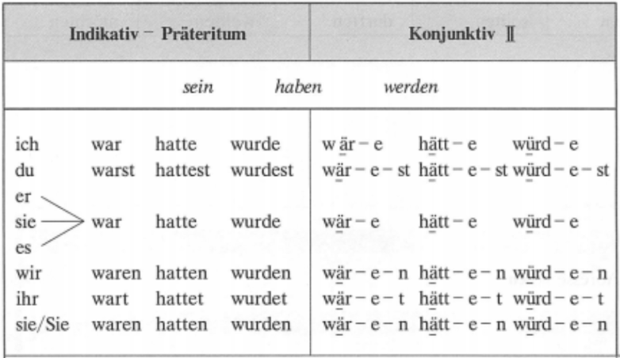
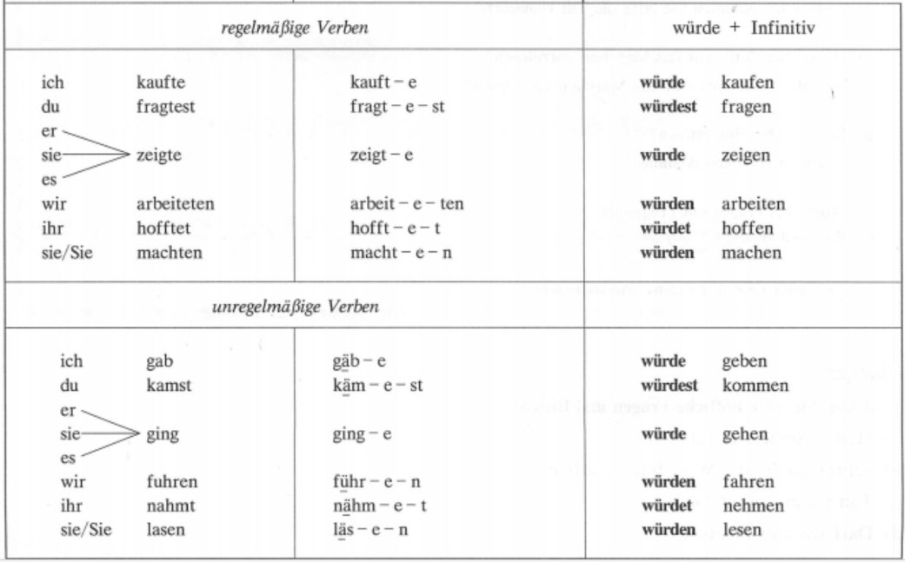
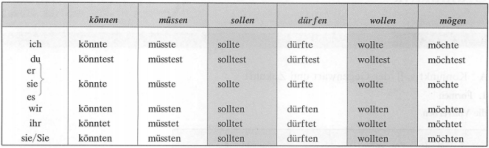
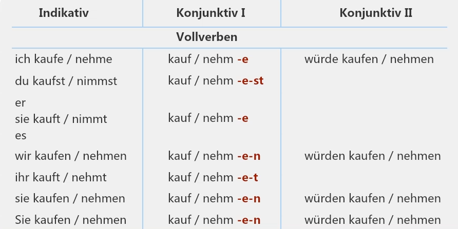
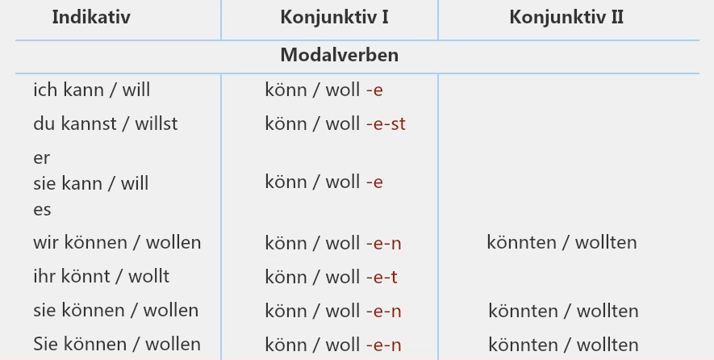
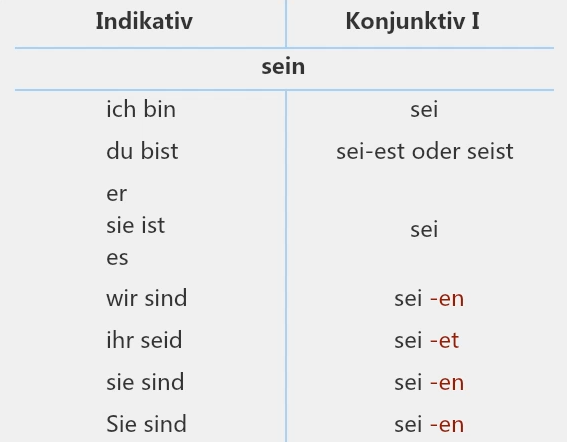

[[Please open with PC or mac，~~mobile phones~~ can not display sidenote，marginnote，flashcards etc. correctly ::highlight]]

* TOC
{:toc}

## Lektion 15 Auskunft
### Reflexive Verben 反身动词

    
  {:.boxit}
  - 反身：句子的主语和宾语指的是同一个人
  - Reflexiv gebrauchte verben 有反身用法的动词 —— 假反身动词
    - 动词本身不需要支配反身，可以支配名词对象
    - 当这个四格名词对象指的是主语本身，则使用反身动词
  - Reflexive Verben 真反身动词
  - Reziproke Verben 有交互关系的动词的反身用法

  | | A. | D.|
  |:----:|:-----:|:----:|
  |ich|mich|mir|
  |du|dich|dir|
  |er/sie/es|sich|sich|
  |wir|uns|uns|
  |ihr|euch|euch|
  |sie/Sie| sich|sich|
  
{:.medium .serif .oblique}
#### Reflexiv gebrauchte Verben
[[有反身用法的动词，假反身动词::lmn]]

{:.medium .serif .oblique}
##### Reflexivpronomen im A.

  - **sich an/melden**  
    - *Er meldet sich **zu** einem Deutschkurs/beim Arzt an.*
    - *Er hat sein Kind zu einem Deutschkurs/beim Arzt angemeldet.*
  - **sich erinnern an jn./etw. (A)** 自己想起 [[jn. an etwas erinnern 使某人想起::rsn]]
    - *Sie erinnert sich gern an ihre Kindheit.*
    - *Das Lied erinnert den alten Mann an ihre Heimat.*
  - **sich ärgern über jn./etw. (A)**
    - *Ich ärgere mich über seine Lüge.*
    - *Seine Lüge ärgert mich.*
  - **sich enteschuldigen bei jm. für etw. (A)**
    - *Der Student entschuldigt sich bei dem Lehrer für die Verspätung.*
    - *Eutschuldigen Sie mich bitte einen Augenblick!*
  - **sich freuen über etw. (A)**
    - *Ich freue mich über die gute Note in der Abschulussprüfung.*
    - *Es Freut mich, dich/Sie Kennenzulernen.*[[常用：认识你很高兴::rsn]] 
  - **sich freuen auf etw. (A)** [[über对已经发生的事情感到很高兴，auf对没有发生的事情感到高兴，期待::rsn]]
    - *Weihnachten steht vor der Tür. Ich freue mich sehr auf Weihnactten.*
  - **sich langweilen**
    - *Wir haben uns auf der Party gelangweilt.*
    - *Die Party langweilt die Gäste.*
  - **sich informieren bei jm. über etw. (A)**
    - *Man kann sich beim DAAD über das Stipendium informieren.*
    - *Der Lehrer informiert die Schüler über die Weihnachtsparty.*
  - **sich interesssieren für etw. (A)**
    - *Ich interessiere mich sehr für Fußball.*
    - *Fußball interessiert die Europäer sehr.*
  - **sich kämmen**
    - *Das Mädchen kämmt sich.*
    - *Die Mutter kämmt das Mädchen.*
  - **sich rasieren**
    - *Der Mann rasiert sich.*
    - *Der Friseur rasiert den Kunden.*
  - **sich setzen**
    - *Setzen Sie sich! [[Nehmen Sie bitte Platz!::rsn]]*
    - *Ich setze das Baby in den Kinderwagen.*

{:.medium .serif .oblique}
##### Refelexivpronomen im Dativ + Akkusativobjekt 

  - **sich etw. (A) leihen** [[反身代词第三格 + 宾语四格::rsn]]
    - *Er leiht sich ein Buch von Klaus.*
    - *Klaus leiht ihm ein Buch.*
  - **sich etw. (A) kämmen**
    - *Ich kämme mir die Haare.*
  - **sich etw. (A) putzen**[[putzen有打扫的意思，这里指刷牙::rsn]]
    - *Er putzt sich seine Zähne.*
  - andere verben wie (sich) etwas waschen - click to expand [[(sich) etwas bestellen;  (sich) etwas holen;  (sich) etwas kaufen;  (sich) etwas kochen;   (sich) etwas wünschen::srs]]

{:.medium .serif .oblique}
#### Reflexive Verben
[[真反身动词, 必须用反身搭配::lmn]]

  - **sich auskennen**
    - *Ich kenne mich hier/in der Stadt gut aus.*
    - *Der Junge kennt sich in Mathematik aus.*
  - **sich bedanken bei jm. für etw. (A)**
    - *Ich bedanke mich bei dir für die Einladung.*
  - **sich bewerden um etw. (A) (bewirbt, bewarb, hat beworben)**[[申请::rsn]]
    - *Er bewirbt sich um einen Studienplatz an der TU-Darmstadt.*
  - **sich erholen**
    - *Im urlaub kann man sich gut erholen.*
  - [[**sich erkundigen bei jm. nach etw.(D)**::highlight]][[向某人打听什么事情::rsn]]
    - *Der Tourist erkundigt sich bei einem Passanten nach dem Weg zum Bund.*
  - **sich umsehen**
    - *Er sieht sich im Zimmer um.*
  - **sich verabreden**和...约会
    - *Ich habe mich **mit** ihm um vier vor dem Kino verabredet.*
  - **sich verlaufen**迷路
    - *Ich bin fremd hier. Ich habe mich in der Stadt verlaufen.*
  - **sich verlieben in jn. (A)**
    - *Der Mann verliebt sich **in** eine schöne Frau.*

{:.medium .serif .oblique}
#### Reziproke Verben
[[交互的反身动词，实际上是真反身和假反身动词里分出来的一种特殊情况::lmn]]

  - **sich begrüßen**
    - *Wir begrüßen uns.*
  - **sich striten (streitet, stritt, haben gestritten)**
    - *Wenn zwei sich striten, freut sich der Dritte.*
    - *Ich habe mich noch nie mit ihm gestritten.*
  - **sich unterhalten über（unterhält, unterhielt, haben unterhalten)**
    - *Auf der Party unterhalten sich die Gäste.*
  - **sich verabreden**
    - *Wir haben uns für morgen ins Theater verabredet.*
  - **sich verstehen**
    - *Die beiden verstehen sich gut.*
  - [[**sich treffen**::highlight]]
    - *Wo treffen wir uns morgen?*

### Wegbeschreibung 指路

{:.boxit}
  - nach rechts/links gehen
  - die 2. Querstrße rechts
  - an der nächsten Ampel rechts
  - immer geradeaus gehen
  - die 1. Querstraße/Pralletstrße links
  - der Zebrastreifen
  - die übernächste Kreuzung[[十字路口，kreuzen使交叉;ankreuzen画叉::rsn]]
  - der Gehweg
  - der Fahrradweg

### Verben mit Präpositionen 动词介词搭配

{:.medium .serif .oblique}
#### Verben mit Dativpräpositionen

  - helfen jm.(D) **bei** + D

---
  - anfangen **mit** etw.(D) 开始 [[与中文不同，德语开始和结束要加介词mit再加宾语::rsn]]
  - aufhören **mit** etw.结束
  - beginnen **mit** etw.
  - sich beschäftigen **mit** etw. 处理，研究，探究，忙于

---
  - sich erkundigen bei jm.(D) **nach** etw.(D)
  - fragen jn.(A) **nach** etw.(D) [[问的内容用介词nach::rsn]]
  - sich sehnen **nach** etw. 思念，想念
  - suchen **nach** etw./jm. [[suchen 可接A::rsn]]

---
  - erzählen jm.(D) **von** etw./jm. [[von加内容::rsn]]
  - reden **von** etw./jm.
  - sich verabschieden **von** jm. 道别
  - sprechen **von** etw./jm. 说到

---
  - einladen jn.(A) **zu** etw.
  - gratulieren jm.(D) **zu** etw. [[zu祝贺原因::rsn]]

{:.medium .serif .oblique}
#### Verben mit Akkusativpräpositionen

  - achten **auf** etw./jn. [[achten不及物，加auf::rsn]]
  - autworten jm.(D) **auf** etw. (A)
  - sich freuen **auf** etw.
  - warten **auf** etw.(A)/jn.
  - sich vorbereiten **auf** etw.(A) 准备

---

  - denken **an** etw.(A)/jn. 想念
  - sich erinnern **an** etw./jn. 回忆

---
  - sich bedanken bei jm. **für** etw.(A)
  - sich interressiren **für** etw./jn.
  - sich entschuldigen bei jm.(D) **für** etw.

---
  - diskutieren mit jm.(D) **über** etw. 
  - erzählen jm.(D) **über** etw. [[von强调讲到事情，über是关于事情详细讲述::rsn]]
  - sich freuen **über** etw. 
  - sich informieren bei jm. **über** etw.
  - sprechen **über** 
  - sich unterhalten mit jm.(D) **über** etw.

---
  - sich kümmern **um** etw/jn.关心
  - bitten jn.(A) **um** etw. 请求某人事情
  - es geht **um** etw. 关于 [[es geht um 固定搭配，总结文章大意；es形式主语，不可省略::rsn]]
    - *Es geht in dem Text um die Wegbeschreibung.*

### Präpositionen mit Fragewort und Pronominaladverbien 

[[带疑问词的介词和代副词::lmn]]

#### Bei Sachen：介词结果针对"物"

  - 疑问句中 wo + (r)介词：wozu, worüber  [[介词首字母/音节是元音字母/音节时，加r::rsn]]
  - 在回答中指代: da + (r)介词：da, darüber 

#### Bei Personen: 介词结构针对"人”

  - In der Frage: 介词 + 疑问代词(wen/wem)
  - In der Antwort: 介词 + 人称代词

### Kounjunktionen 连词

{:.boxit}
  - und 和：表并列关系，可接句子成分也可接句子
  - aber 但是:表转折关系，常接句子，也可接句子成分
  - oder 或者：表选择关系，可接成分也可连接句子
  - denn 因为：表因果，连接句子
  - sondern 而是：表递进，可连接句子成分也可连接句子，常以nicht..., sondern形式出现
  - entweder .. oder 要么..要么；或者..或者（二选一）
  - weder .. noch 既不..也不（两者都不）
  - nicht nur ..., sondern auch 不仅..而且（两者都）
  - zwar ..., aber 虽然.. 但是（转折）

---
  - **und,aber,oder,sondern可连接句子成分也可以连接两个句子，denn一般只连接句子**
  - und,aber,oder,sondern,denn都**不占位**
  - entweder占位，oder不占位
    - Entweder du oder ich **gehe** [[当并列的是主语部分时，谓语动词由离它最近的主语决定::rsn]] zum Bahnhof zu Fuß. 
    - Entweder ich oder du **gehst** zumm Bahnhuf zu Fuß.
  - weder占位，noch占位 [[noch占位后反语序中主语不省略noch gehe ich::rsn]]
  - nicht nur 占位，sondern auch不占位
  - zwar占位，aber不占位  

### 其他

  - teinehmen an etwas (D) 参加
    - *Er nimmt an dem Tischtennisturnier am Samstag teil.*
  - lachen über etwas/jn. 嘲笑
  - für etwas gültig sein = gelten für (das gilt für...)适用于
  - ein Formular ausfüllen 填表格
  - abgeben + A. 上交

{:.medium .serif .oblique}
### Situative Fragen
  - Sie stehen auf der Straße und möchten zur nächsten Post fahren. Fragen Sie bitte einen Fußgänger.
    - *Entschuldigen Sie! Wie komme ich am besten zur Post？* [[page8, Spechen::rsn]]
  - Sie Stehen in der Mitte in einem Bus und möchten an der nächsten Station aussteigen. Was sagen Sie zu dem Mann vor Ihnen?
    - *Entschuldigung Sie, ich muss an der nächsten Station aussteigen. Darf ich durch.* [[借过一下::rsn]]
  - Sie möchten zum Hauptbahnhof fahren. Fragen Sie bitte den Busfahrer.
    - *Entschuldigen Sie! Fährt der Bus zum Haptbahnhof? / Ist das der richtige BUs zum Haptbahnhof?*
  - Jemand fragt Sie nach dem Weg. Sie sind aber auch fremd in der Stadt. Was sagen Sie?
    - *Tut mir leid, ich bin auch fremd hier./ Ich kenne mich hier nicht gut aus. Fragen Sie lieber andere.*
  - Es ist schon sehr spät und es fährt kein Bus mehr. Sie Stehen auf der Straße. Da kommt zum Glück Ihr Mitstudent in einem alten Auto vorbei und hält an. Was sagen Sie zu ihm?
    - *Hallo, XX, Wohin fährst du jetzt? Ich wollte mit dem Bus nach Hause fahren, aber jetzt fährt kein Bus mehr. Darf ich wielleicht in deinem Auto mitfahren?*
  
  <!-- - Es ist schon sehr spät und es fährt kein Bus mehr. Sie fahren mit einem Taxi nach Hause. Da sehen Sie eine junge Dame aud der straße, sie wartet noch auf den Bus. Was sagen Sie zu ihr?
    - *Guten Abend! Es fährt jetzt leider kein Bus mehr. Wenn es Ihnen -->

## Lektion 16 Sportarten

### Nebensatz mit "dass" und "ob"

{:.medium .serif .oblique}
#### dass und ob

  {:.boxit}
  - dass-Satz (bei Aussagesatz陈述句)
  - ob-Satz (bei Ja-Nein-Frage一般疑问句)

{:.medium .serif .oblique}
#### Verstellung im Satzgefüge (Hauptsatz + Nebensatz)

[[主从句中动词位置::lmn]]

##### 主句在前，从句在后
   
| Hauptsatz| Nebensatz|
|:-----:|:-----:|
|Er hat gesagt,|**dass** er morgen zwei Karten **kauft**.|
|Sie fragt ihn,|**ob** er das Fußballspiel *sehen* **will**.|
|Michael weiß nicht,| **ob** er ins Kino **geht**.|
|Es ist schade,|**dass** Michael nicht **mitkommt**.|

- 主句中动词语序与简单句中动词语序一致，主从句中间用逗号隔开
- 从句中从句连词第一位，谓语动词部分位于从句最后， 变位动词在从句最后位(尾语序)，可分动词部分合在一起写，其他成分位置与简单句一致。

##### 从句在前，主句在后

| Nebensatz | Hauptsatz |
|:-----:|:-----:|
|**Dass** er morgen zwei karten **kauft**,| **hat** er gesagt.|
|**Ob** er das Fußballspiel *sehen* **will**,| **fragt** sie ihm.|
|**Ob** er ins Kino **geht**,| **weiß** Michael nicht.|
|**Dass** Machael nicht **mitkommt**,|**ist** schade.|

- 从句在前时语序与后时一致，连词带起从句，谓语动词在从句末
- 主句中变位动词应放在主句首位，接下来主语等其他成分，其他成分与简单句一致[[相当于把从句整个部分看成长句第一位，根据动词二位原则，接下来要接长句动词，也就是主句动词::rsn]]
- 当从句在前时，主句中充当形式主语的es可以省略

### Fragewörter im Nebensätze

[[带疑问词的从句, 由特殊疑问句转换而来，疑问词引导从句，其他语序等特点和dass,ob引导从句一致，句子的标点由主句决定::lmn]]

  - **Was** machen Sie am Wochenende?
  - *Wie bitte?*
  - Ich möchte wissen, **was** Sie am Wochenende **machen**.
  
---

  - **Welche** **Sportart** gefält Wang Dali?
  - Leider weiß ich auch nicht, **welche** **Sportart** ihm **gefält**.

### wissen kennen und kennen lernen

{:.boxit}
  - kennen: 认识，强调熟悉、了解，是一个时间段的状态(wie lange)
  - kennen lernen: 相识，结识， 强调从不知到获知的过程，是一个发生在时间点的动作 (wann)
  - kennen lernen --> kennen
  - kennen gelernt
  - kennen,wissen在表示知道、了解的意义时，kennen更强调对某人、某的性格、特点更进一步的认知，wissen更强调由自己的所听所经历而得知。
  - kennen后常接具体名词/人，wissen后常带从句以及指示代词。
  - Er weiß das, alles, nichts, viel, wenig. 

### Genitiv

  **Was ist Genitiv?**
  - 作定语, 表示所属(所有格)
    - das Haus von meinem Bruder 借助介词表示所属
    - das Haus meines Bruders 用第二格表示所属
  - 句子搭配要求(动词、形容词、介词等)
    - Ich bin **der Meinung**, dass ...
    - Viele junge Menschen treiben diesen Sport **wegen der Gefahr** und der Spannung.

{:.medium .serif .oblique}
#### Genitiv bei Artikeln und Possessivpronomen

[[二格中冠词和主代词的词尾变化::lmn]]

| | bestimmter Artikel| unbestimmter Artikel| Possessivpronomen|
|:-----:|:-----:|:-----:|:------:|
|m| das Büro **des** Lehrers| das Büro **eines** Lehrers| das Büro **meines** Lehrers|
|n| die Schule **des** Kindes| die Schule **eines** Kindes| die Schule **ihrers** Kindes|
|f| die Uhr **der** Frau| die Uhr **einer** Frau| die Uhr **seiner** Frau|
|Pl.| die Taschen **der** Frauen| -- | die Taschen **unserer** Frauen|

  - 阳性、中性名词单数在第二格时有词尾变化
    - 大多数多音节名词词尾直接加s，如des Lehrers, des Verkäufers, des Früstüks usw.
    - 单音节词词尾常加es，不造成发音困难时也只加s，如des Kindes, des Spieles(des Spels), eines Buches(eines Buchs)
    - 以s, ß, x, z, sch结尾，词尾必须加es，如des Buses, eines Fußes, des Tisches usw.
    - 阴性单数和复数名词无词尾变化：einer Frau, der Bücher...
  - wessen谁的：wer第二格形式

{:.medium .serif .oblique}
#### Genitiv bei Namen

[[名字的第二格::lmn]]

  - 名字词尾直接加s，这里也包括地名以及中性的国民
    - Hangzhous Landschaft, Chinas Essen usw
    - Herr**n**[[Herr是阳性弱变化名词::rsn]] Hoffmanns Garten
  - 当名字结尾是s,ß,x以及z结尾时，名字词尾不要再加s，只需要`'`
    - Franz' Arbeit gefällt ihn nicht
    - Hans Groß' Frau ist klein

{:.medium .serif .oblique}     
#### Adjektiv-Deklinationen im Genitiv

[[第二格中形容词的词尾变化::lmn]]

| m | n | 
|:----:|:----:|
|das Spiel des neu**en** Spielers| die Übnung des alt**en** Buches|
|das Spiel eines neu**en** Spielers| die Übnung eines alt**en** Buches|
|das Spiel meines neu**en** Spielers| die Übnung unseres alt**en** Buches|
|der Preis schwarzen Tees| der Preis frischen Wassers|

|f| pl.| 
|:----:|:----:|
|der Sieg der bekannt**en** Mannschaft| die Meinungen der berufstätig**en** Frauen|
|der Sieg einer bekannt**en** Mannschaft| die Meinungen unserer berufstätig**en** Frauen|
|der Sieg unserer bekannt**en** Mannschaft| die Meinungen unserer berufstätig**en** Frauen|
|der Preis frisch**er** Milch| die Meinungen berufstätig**er** Frauen| 

  - 只要形容词前有冠词，无论是定冠词、不定冠词、还是物主代词，形容词词尾均为en。即按弱变化规则变
  - 阴性单数零冠词和复数零冠词时形容词按强变化规则，词尾为er
  - 二格结构中冠词(定冠词、不定冠词、物主代词)以及阳中性名词单数本身的二格词尾不要忘记。尤其是阳性和中性名词零冠词时，词尾的s/es不要忘记

{:.medium .serif .oblique}
#### Präpositionen: trotz, wegen, während, statt/anstatt + G

  - Es regnet sehr stark. Aber er geht spazieren.
  - --> **Trotz** des starken Regens[[名词化::rsn]] geht er spazieren. 
  
---
  - Die Sportlerinwar schwer krank. Sie durfte nicht Tennis spielen.
  - --> **Wegen** ihrer schweren Krankheit durfte sie nicht Tennis spielen.

---
  - Die Touristen machen Urlaub. Sie haben wieles gesehen und erlebt.
  - --> Die Touristen haben **während** des Urlaubs vieles geschen und erlebt.

---
  - Er möchte ein Radio kaufen, findet aber kein gutes Radio. Er kauft einen billigen Fernseher.
  - --> **Statt** eines Radios kauft er einen billigen Fernseher.

### Schreiben Text D
> --Einleitung
>   - Es geht in dem Text un ...
>   - Der Text berichtet über ...
> --Argumente gegen den Profisport
>   - Der Text **nennt** ...
>   - Erstens ...
>   - Zweitens ...
>   - Drittens ...

Erstens ist die Kommerzialisierung des Sports. Die Sportler weben für viele Dinge, die Leute müssen sie kaufen. Das hat mit Sport nichts zu tun. Zweitens ist es, dass Hochleistungssport ...
**Ein weiterer Augument dagegen ist**, dass ...
**Der dritte Argument ist, dass** sie wegen des harten Trainings keine Zeit für die Schule und Ausbildung haben. ...

### Worblidung 词汇构成

{:.medium .serif .oblique}
#### Suffixe -ung und -tion bei Fremdwörtern

| Substantiv(Verbstamm + Endung) | Verb |
|:-----:|:------:|
| die Beschäftig**ung**, -en | (sich) Beschäftigen|
| die Ausstell**ung**, -en| ausstellen|
|die Informa**tion**, -en | informieren|

- 词性大多数是die，**Aber**: der Aufschwung, die Aufschwünge[[Das Geschlecht der Nomen::rmn-transclude]]

{:.medium .serif .oblique}
#### Suffixe -heit und -keit 

|Substantiv(Verbstamm + Endung) | Verb |
|:-----:|:------:|
|die Gesund**heit**|gesund|
|die Berühmt**heit**| berühmt|
|die Wichtig**keit**| wichtig|

- 以-ig, -lich, -sam, -bar结尾的形容词变化而来的名词都以-keit结尾
- **Aber**：Sauberkeit整洁，Tapferkeit勇敢，Heiterkeit喜悦 
- 其他基本以-heit结尾
- 有形容词变化而来的名词，词性都为die，一般没有复数形式

## Lektion 17 Frauen

### Wortbildung

{:.medium .serif .oblique}
#### Suffixe -er, -ent

|Person(männlich)|Person(weiblich)|Verb|
|:-----:|:-----:|:------:|
|der Lehr**er**,-|die Lehr**er**in,-nen| lehren|
|der Verkäufer,- 售货员|die Verkäuferin,-nen|verkaufen|
| der Betreuer,- 导师|die Betreuerin,-nen|betreuen|
|der Zuschauer,- 观众|die Zuschauerin,-nen|betreuen 照顾|
|der Zuhörer,- 听众|die Zuhörerin,-nen|zuhören|
|der Bewerber,- 申请者|die Bewerberin,-nen|bewerben sich um|
|der Emmpfänger,- 收信人|die Empfängerin,-nen|empfangen|
|der Verfasser,- 作家| die Verfasserin,-nen| verfassen|
|der Leser,- 读者| die Leserin,-nen| lesen|
|der Raucher,- / 不抽烟的人Nichtraucher|die Raucherin,-nen|rauchen|

----

|der Stud**ent**,-en|die Stud**en**tin,-nen|studieren|
|der Interess**ent**,-en|die Interess**ent**in,-nen|sich interessieren für|

### Nebensatz mit "weil" und "da" (klausal satz)

| Hauptsatz | Nebensatz |
|:-----:|:-----:|
| Ich kann Herrn Weber nicht anrufen, | **weil** er im Ausland **ist**.|
| Er muss im Bett bleiben, | **weil** er Fieber **hat**.|

oder:

| Nebensatz | Hauptsatz |
|:-----:|:-----:|
| **Weil/Da** Herr Weber im Ausland **ist**,| **kann** ich ihn nicht anrufen.|
|**Weil/Da** er Fieber **hat**,|**muss** er im Bett bleiben.|
|**Weil/Da** sie zu Hause bleiben **will**,| **kommt** sie nicht mit.|
|**Weil/Da** er kein Geld **hat**,| **kann** er kein Auto kaufen.|

- Da 一般放句首

### Hauptsatz mit "deshalb"

| Hauptsatz | [[Hauptsatz::highlight]] |
|:-----:|:-----:|
| Li Ling studiert noch an der Universität.| **Deshalb** darf sie nicht heiraten.|
|Der Mantel ist zu lang,|**deshalb** passt er ihr nicht.|

- 区分da, weil, denn(不占位), deshalb, wegen(+G)
- deshalb, like und,aber,oder and denn, connects two main clauses(Hauptsätz)

### Nebensatz mit "wenn/falls" (Konditionalsatz)

| Hauptsatz | Nebensatz |
|:-----:|:-----:|
|Ich besuche dich,|**wenn** ich Zeit **habe**.|
|Sie geht gern einkaufen,|**wenn** sie Geld **hat**.|
|Herr Liu möchte nach Xi'an fahren,|**wenn** er Urlaub **hat**.|

oder:

| Nebensatz | Hauptsatz |
|:-----:|:-----:|
|**Wenn/Falls** ich Zeit **habe**,| **besuche** ich dich.|
|**Wenn/Falls** sie Geld **hat**,|  **geht** sie gern einkaufen.|
|**Wenn/Falls** Herr Liu Urlaub **hat**,|**möchte** er nach Xi'an fahren.|

### Nebensatz mit "obwohl" (Konzessivesatz)

[[让步从句::lmn]]

| Haptsatz | Nebensatz |
|:-----:|:-----:|
| Ich habe eine Verabredung mit ihr, | **ohwohl** ich keine Zeit **habe**.|
| Herr Liu kann Deutsch gut sprechen,|**obwohl** es sehr schwer **ist**.|
| Er ist nicht mitgekommen,|**obwohl** ich ihn mehrmals eingeladen **habe**.|

oder:

| Nebensatz | Hauptsatz |
|:-----:|:-----:|
| **Obwohl** ich keine Zeit **habe**,| **habe** och eine Veravredung mit ihr.|
|**Obwhol** Deutsch sehr schwer **ist**,|**kann** Herr Liu es gut sprechen.|
|**obwhol** ich **ihn einladen habe**, | **ist** er nicht mitgekommen

### Hauptsatz mit "trotzdem"

| Hauptsatz | **Hauptsatz** |
|:-----:|:-----:|
| Ich habe keine Zeit. | **Trotzdem habe** ich eine Verabredung mit ihr.|
| Deutsch ist schwer.| **Trotzdem kann** Liu es gut sprechen.|
| Ich habe ihn mehrnals eingeladen,|**trotzdem ist** er nicht mitgekommen.|

#### die gleiche Bedeutung trotz/obwohl

| Trotz ...| Obwohl ... | 
| Trotz der Gefahr | Obwohl es gefährlich ist, ..|
| Trotz des schlechten Wetters | Obwhol das Wetter schlecht ist,|
| Trotz seiner Krankheit | Obwohl er krank ist,|
| Trotz ihrer Verlezung | Obwohl sich Frau Liu verletzt ist,|
| Trotz seines hohen ALters | Obwohl der Mann sehr alt ist,|
| Trotz seiner Hilfe|Obwohl er mir geholfen hat, |
| Trotz der Dunkelheit| Obwohl er dunkel war,|
| Trotz der Eile | Obwohl ich mich beeilt habe,|
| Trotz des schlechten Spiels| Obwohl er schlecht spuelte,|
| Trotz meiner Entschuldigung| Obwohl ich mich entschuldigt habe,|

### Wortschatz

{:.medium .serif .oblique}
#### erfaren-wissen 
  - erfahren：Informationen bekommen 
    - 获悉、得知某种信息，强调信息获得动作，常用完成时 
    - erfahren常会指出信息来源或时间 von jm. oder aus etwas (dem Brief, der Nachricht) erharen
    - *Das habe ich erst gestern erfahren.*
  - wissen: Informationen haben
    - 知道、掌握某种信息
    - 强调拥有某种信息的状态，常用一般现在时。并不强调信息来源，常会与das, alles, nichts, viel, wenig这样一些指示代词或不定代词连用。
    - *Das weiß ich nicht. Er weiß alles.*

{:.medium .serif .oblique}
#### suchen-finden
  - suchen 强调“寻找”这个过程，不一定能找到
  - finden 强调“找到”的这个结果

{:.medium .serif .oblique}
#### finden-feststellen
  - finden = meinen/der Meinung sein
    - 觉得，认为；用来表达个人观点、感受
    - 常接从句或简单句结构etwas(A) richtig, falsch, gut, in Ordnung
    - Ich finde, dass...
  - feststellen
    - 发觉、确定；不再是仅仅觉得、认为，而是进一步的确定某一个事实
    - *Er fährt seit einer Stunde mit dem Zug. Plötzlich stellt er fest, dass seine Fahrkarte weg ist. Er sucht und sucht und kann sie nicht finden.*

### 其他
  - etwas (für etwas) mitbringen 具备，具有
  - jn. unterstützen 支持某人
  - o. ä. oder ähnliches

## Lektion 18 Kinder und Jugendliche

### Infinitiv mit "zu"

[[带zu不定式::lmn]]

{:.boxit}
  - zu后面只允许一个动词不定式（现在时中变位动词部分），动词之前的其他搭配部分（如四格宾语、介词搭配等）放置于zu之前
  - 可分动词：zu置于可分前缀和词干之间，合在一起写
  - 带zu不定式部分通常用逗号和前面的主句部分隔开（不定式部分只有一动词无其他搭配时无须逗号，z.B. *Kinder haben große Lust zu spielen.*

{:.medium .serif .oblique}
#### Infinitiv + zu/dass-Satz
  - 不定式组的逻辑主语和主句一致
    - Birgit hofft, die Prüfung bestehen **zu** können.
  - 不定式组的逻辑主语是主句第三格，或第四格补足语  
    - Die Eltern schlagen Birgit vor, an der Prüfung teil**zu**nehmen.
  - 不定式组的逻辑主语以其他形式在主句中出现，或者可默认为指的针对任何人（常当不定式组充当主语时）
    - Es ist für alle Schüler wichtig, die Prüfung **zu** bestehen.
  - 综上，带zu不定式逻辑主语要在主句中能找到（主句主语、主句三格或四格语），或者能默认为泛指任何一个人（此时逻辑主语可在主句中不体现），反之只用dass从句
    - Die Eltern hoffen, **dass** Birgit die Prüfung bestehen kann.

{:.medium .serif .oblique}
#### Verben, Adjektive und Nomen in Verbindung mit Infinitiv mit “zu”

[[和带zu不定式搭配的动词、形容词和名词::lmn]]

  - Verben 
    - 带zu不定式充当主句动词的四格宾语或介词补足语
      - anfangen: *Er hat (damit) angefangen, in der Firma zu arbeiten.*
      - 类似动词：aufhören, beginnen, bitten(um), sich freuen(auf/über), raten(zu), sich gewöhnen an
    - 充当四格宾语
      - erlauben: *Er erlaubt mit, hier zu rauchen.*
      - 类似动词：hoffen, verbieten, versprechen, versuchen, vorhaben, vorschlagen, vergessen, empfehlen.
  - Adjektive 带zu不定式充当主语
    - Es ist gut, hier zu sein.
    - Es ist für ihn leicht, das Wort auszusprechen.
    - **Es ist (Adjektiv), ... zu ...**
    - **Oder**
      -  Hier zu sein ist gut. [[无须逗号和es::rsn]]
      -  Das Wort auszusprechen ist für ihn leicht.
    - 类似形容词（第二分词）：gut, leicht, möglich, notwendig, schlecht,schön, schwer, üblich, wichtig, erlaubt, verboten
  - Nomen 带zu不定式充当后置定语，修饰主句出现的名词
    - Das Kind hat Angst, allein nach Hause zu gehen.
    - Kinder haben große Lust zu spielen.
    - **Jemand hat (Nomen)(,) ... zu ...**
    - 类似名词：Angst, die Hoffnung, Lust, die Möglichkeit, die Pflicht, den Wunsch, Zeit

### Briefformen 
  See [Briefschreiben.pdf](https://mailustceducn-my.sharepoint.com/:b:/g/personal/wushunyu2401_mail_ustc_edu_cn/EcHkhK7CB3hNnct3L7HpQdEB9dENUVssad5vl-X70Q6ozA?e=CnQ2Bk)

### Wortschatz

{:.medium .serif .oblique}
#### erziehen (die Erziehung) - ausbilden (die Ausbildung)

  - erziehen 教育，培养，教养：对人（尤其是儿童）思想、性格、行为方式、未来发展等品行的培养
  - ausbildung 训练、培训：主要是职业性方面的，如学校的专业学习或职业培训机构的学习

{:.medium .serif .oblique}
#### lernen - studieren

  - lernen 技能、知识学习，中小学学习
    - z.B. Fremdsprache/Autofahren lernen usw.
  - studieren 研究型学习，大学专业学习
    - Informatik/Sinologie studieren usw.
    - studieren 作不及物动词时专指上大学

{:.medium .serif .oblique}
#### spielen
  
  - spielen作不及物动词，表示玩耍时专指儿童的游戏，汉语中成年人之间的玩不能译为spielen，可以译为sich unterhalten(放松、消遣)或者具体说明“玩”什么，怎么“玩”
  - spielen作及物动词 经常和球类、乐器名词、游戏类名词搭配
    - Klavier spielen，Karten spielen, Conputer spielen

### Nebensatz mit "um ... zu" und "damit ..." (Finalsatz)

  - 主语不一致用damit
    - Hans rachut zu Hause nicht, damit seine Frau und seine Tochter nicht passiv mitauchen müssen.
  - 主语一致用可以um...zu代替
    - Sie geht in den Kindergarten, um ihr Kind abzuholen.
    - Sie geht in den Kindergarten, damit sie ihr Kind abholt.

### Wortbildung
#### Präfix: un- (bei Adjektiven)

  - klar - unklar
  - glücklich - unglüklich
  - ordentlich - unordentlich
  - möglich - unmöglich
  - genau - ungenau
  - interessant - uninteressant

## Lektion 19 China
### Relativsatz 

[[关系从句::lmn]]

{:.medium .serif .oblique}
#### Relativsätze mit dem Relativpronomen

| Kasus | Maskulin | Neutrum | Feminin | Plural | 
|:----:|:----:|:-----:|:-----:|:-----:|
|Nom.| der | das | die | die |
|Gen.| dessen | dessen | deren | deren | 
|Dat.| dem | dem | der | **denen**|
|Akk.| den | das | die | die |

  - 关系从句第三格复数用**denen**
  - Der Mann kennt den Weg nicht. **Der Mann** steht dort.
    - Der Mann, **der** dort steht, kennt den Weg nicht. (N)
  - Das Kind ist nicht von hier. Ich habe **das Kind** gefragt. 
    - Das Kind, **das** ich gefragt habe, ist nicht von hier. (A)
  - Die Frau versteht mich nicht. Ich have **der Frau** geantworted.
    - Die Frau, **der** ich geantwortet habe, versteht mich nicht. (D)
  - Die Leute verstehen mich nicht. Ich habe **den** Leute**n** geantworted.
    - Die Leute, **denen** ich geantwortet habe, verstehen mich nicht. (D)
  - Der Film hat ein Happy End. Der Anfang des **Films** ist so traurig.
    - Der Film, **dessen** Anfang so trautig ist, hat ein Happy End. (G)

{:.medium .seirf .oblique}
#### Relativsätze mit Präpositionen

  - Beispiele:
    - Wo ist die Frau? Ich habe eben **mit** **ihr** gesprochen.
    - `->` Wo ist die Frau, **mit** **der** ich eben gesprochen habe?
    - Endlich kommt der Einladungsbrief von Professsor Kim. **Auf den Brief** habe ich schon lange gewartet.
    - `->` Endlich kommt der Einladungsbrief von Professsor Kim, **auf den** ich schon lange gewartet habe.
    - Die Touristen kommen aus Deutschland. Er unterhält sich mit ihnen.
    - `->` Die Touristen, **mit** **denen** er sich unterhält, kommen aus Deutschland.
  - Achtung
    - Herr Wang ist mein Chef. Ich bin mit **seiner** Tochter befreundet.
    - `->` Herr Wanf, mit **dessen** Tochter ich befreudet bin, ist mein Chef-
    - Herr Wang hat mich entlassen. Ich habe mich in **seine** Tochter verliebt.
    - `->` Herr Wang, in **dessen** Tochter ich mich verliebt habe, hat mich entlassen.

{:.medium .seirf .oblique}
#### Relativsätze mit "was" (nur im Nominativ und Akkusativ)

 {:.boxit}
 当相关词是das, alles, nicht, etwas, einiges, winiges, manches, vieles, usw. (指代"物"的代词); das Schönste, das Letzte, das Beste usw. (由形容词最高级变化而来的抽象名词)，在关系从句中它们的关系代词都是was，was只有一格和四格的情况

 - **Das**, **was** ich dir gesagt habe, darfst du nicht weitersagen.
 - **Alles**, **was** ich in China erlebt habe, ist unvergesslich.
 - **Das Schönste**, **was** er mir erzählt hat, ist seine Liebesgeschichte.
 - **Nichts**, **was** er macht, interessiert mich.
 - **ähnlich**: etwas, einiges, weniges usw.; das Letzte, das Beste usw.

### Wortschatz
#### alles-alle; viel(es)-viele; beides-beide

  | bei Personen/Sachen mit dem bestimmten Artikel | bei Sachen mit Nullartikel|
  |:------:|:-------:|
  |alle | alles|
  |viele|viel(es)|
  |beide|beides|

  - `*`Was essen Sie gern?
  - `+`Fisch, Fleisch, Gemüse, **alles** schmeckt mir.
  - `*`Lesen Sie Zeitungen, Zeitschriften oder Bücher?
  - `+` Ich lese **alles**.
  - `*`Wir sind deine Freunde?
  - `+`Maria, Hans, Susi, Thomas, **alle** sind meine Freunde.
  - Obwohl Herr Neugier **viel(es)** weiß, hat er immer noch Fragen.
  - `*` Was wollen Sie, Geld oder Leben>
  - `+` **Beides**!
  - `*` Gäfallt dir der rote oder der blaue Pullover?
  - `+` **Beide** gefallen mir sehr.

### Wortbildung
#### Artikei bei Zusammensetzungen

  {:.boxit}
  - Bestimmungswort（限定词）+ Grundwort（基本词）= Zusammensetzung（复合词）
  - 复合词的冠词（词性）及复数变化和基本词保持一致
  - die Land + die Karte = die Landkarte
  - die Zeitung + der Text = der Zeitungstext
  - der Tee + das Haus = das Teehaus

#### Arten von Zusammensetzungen
  - Nomen + Nomen
    - der Computerkurs, das Klassenzimmer
  - Verbstamm + Nomen 动词词干 + 名词
    - das Fahrrad, der Gehweg
  - Adjektiv + Nomen
    - das Großstadt, die Freizeit

#### Auflösung der Zusammensetzungen
  - 分解形式
    - 形容词 + 名词
      - die Freizeit, die freie Zeit
      - die Großstadt, die große Stadt
    - 基本词 + 限定词二格（存在所属关系时）
      - der Landesteil, der Teil der Landes
      - die Jugendkriminalität, die Kriminalität der Jugend
    - 基本词 + 介词 + 限定词
      - das Kinderbuch, das BUch für Kinder
      - das Stofftier, das Tier aus Stoff
    - 名词 + 关系从句
      - der Spielplatz, der Platym auf dem Kinder spielen dürfen

#### "-s-" zwischen Bestimmungswort und Grundwort

  - der Zeitung**s**text, der Gesundheit**s**zustand, der Tätigkeit**s**bericht, das Wirtschaft**s**studium, die Relativität**s**theorie, der Produktion**s**plan
  - 当限定词词尾以-ung, -heit, -keit, -schaft, -tät, -tion结尾时，限定词和基本词之间一般以s连接

### Verschiedenes

  - von ... begeistert sein 因为...兴奋
  - etwas hat etwas mit etwas/jm. zu tun 某事和某事有关
    - z.B. Was hat deine Sache mit mir zu tun?
  - lauter纯粹的，净是的（无形容词词尾变化）
    - Das ist lauter Wahrheit. 这是纯粹的真相
  - A. + entlang 沿着
  - in Richtung Westen/Osten/Süden/Noden
  - etwas(A) als etwas(A) bezeichen 把..称作..
  - der Wolkenkratzer 摩天大厦 (EN: skyscraper)
    - Wolken云 + Kratzer刮具
  - eine Menge （+泛指名词）大量、大批
    - eine Menge Leute
    - eine Menge Geld
  - vergleichen + A. + mit 把...和...相比
  - jn. verwöhnen宠溺

## Lektion 20 Deutschland
### Wortschatz
#### Das Land, das Bundesland, das Ausland, das Inland

  - auf dem Land在农村
  - in Deutschland, im Heimatland在祖国
  - Deutschland hat 16 Bundesländer.
  - der Ausländer, der Inländer

### Plusquamperfekt 

#### 过去时态回顾 Perfect / Präteritum
  - Perfect 现在完成时，常用于口头或日常生活交流中，强调事件的完成对当下产生的影响
    - haben/sein + Partizip II
    - 常用sein作助动词的动词：fahren, fliegen, reisen, steigen, einschlafen, aufwachen, aufstehen, werden, bleiben, sein ...
  - Präteritum 一般过去时 常用于叙述童话、故事、报刊报道等，强调事件的过去性，叙述者与事件保持距离

#### 过去完成时

  - 指在一个过去的动作之前就完成的动词，即“过去的过去”
  - 完成的事件，侧重事件带来的影响
  - **hatte**... (**war**...) + Partizip II
    - `+`Hat sie die Wäsche schon gewaschen?
    - `*`Nein. Sie wollte die Wäsche am Nachmittag waschen aber ihr Mann **hatte** die Wäsche schon am Monrgen **gewaschen**.

### Temporalsatz 

{:.medium .serif .oblique}
#### "wenn" und "als"

  - a) Sie wurde 4 Jahre alt. Da bekam sie viele Geschenke.
    - **Als** sie 4 Jahre alt **wurde**, **bekam** sie viele Geschenke. [[时态都是一般过去时::rsn]]
  - b1) Ich kam nach Rom. Die Sonne schien immer.
    - **Jedes Mal(Immer) wenn** ich nach Rom **kam**, **schien** die Sonne. [[一般过去时::rsn]]
  - b2) Der deutsch Student hat Ferien. er geht immer arbeiten.
    - **Jedes Mal(Immer) wen**n der deutsche Student Ferien **hat**, **geht** er arbeiten. [[一般现在时::rsn]]
  - c) Im Jahre 2025 bin ich 55 Jahre alt. Dann ist mein Mann 56.
    - **Wenn** ich im Jahre 2025 55 Jahre alt **bin**, **ist** mein Mann 56. [[将来::rsn]]

  | | Vergangenheit过去| Gegenwart/Zukunft 现在/将来|
  |:-------:|:-------:|:-------:|
  |Einmalige Handlung一次性的行为|**als**(a.)|wenn(c.)|
  |Mehrmalige Handlung多次性的行为|wenn(b1.)|wenn(b2.)| 

{:.medium .serif .oblique}
#### "während", "bevor" und "nachdem"

  {:.boxit}
  - während 在...期间，当...时候（强调同时性，对比性）
  - bevor 在...之前（主句动作发生在从句前）
  - nachdem 在...之后（主句动作发生在从句后）

-----

  - a) Der Mann frühstückt. Er liest gleichzeitig Zeitung.
    - **Während** der Mann frühstückt, liest er Zeitung.
  - a2) Er studierte an der Uni. Seine Schwester lernt in der Schule.
    - **Während** er an der Uni studierte, lernte seine Schwester in der Schule.
  - b1) Er geht zu seiner Freundin. Vorher ruft er sie an.
    - **Bevor** er zu seiner Freundin **geht**, **ruft** er sie **an**.
  - b2) Ich bin in die neue Wohnung eingezogen. Vorher habe ich sie gestrichen.
    - **Bevor** ich in die neue Wohnung **eingezogen bin**, **habe** ich sie gestrichen.
  - c1) Ich schreibe eine Postkarte. Danach bringe ich sie zur Post.
    - Nachdem ich eine Postkarte **geschrieben habe**, **bringe** ich sie zur Post.
  - c2) Er kam in Deutschland an. Danach besuchte er seinen Professor. [[两个事件都是发生在过去，但是nachdem带起的句子发生在besuchte seine Prof之前，所以是过去的过去::rsn]]
    - **Nachdem** er in Deutschland **angekommen war**, **besuchte** er seinen Professor.

  |  | Nebensatz| Hauptsatz|
  |:------:|:------:|:-----:|
  |während| Präsens|Präsens|
  |während| Perfekt/Präteritum|Perfekt/Präteritum|
  |bevor|Präsens|Präsens/Perfekt|
  |bevor|Perfekt/Präteritum|Perfekt/Präteritum/Plusquamperfekt|
  |nachdem|**Perfekt**|**Präsens**|
  |nachdem|**Plusquamperfekt**|**Perfekt**/**Präteritum**|

  - während同时发生，主句和从句时态一致
  - bevor 主句发生早（过去），从句发生晚
  - während和bevor主从句时态可以一致，nachdem主从句一定要有时态区别
  - nachdem 从句要比主句早一个时态，因为从句发生动作在主句前完成（nachdem带起从句总是**完成时**或者过去**完成时**）

{:.medium .serif .oblique}
#### “seitdem(seit" und "bis"

  {:.boxit}
  - seitdem(seit) 自从...以来
  - bis 到...为止

-----

  - Frau Li macht morgens Taiji. Seitdem geht es ihr besser.
    - **Seitdem**(**Seit**) Frau Li morgens Taiji macht, geht es ihr besser.
  - Er ist nach Shanghai umgezogen. Seitdem wohnt er immer in der Nanjing Strße.
    - **Seitdem**(Seit) er nach Shanghai umgezogen ist, wohnt er immer in der Nanjing Straße.
  - Sie wartet. Der Bus kommt.
    - Sie wartet, **bis** der Bus kommt.
  - Der Mann stand an der Bushaltestelle. Der Bus war außer Sicht[[außer在..之外，Sicht视线， 驶出视野::rsn]].
    - Der Mann stand an der Bushaltestelle, **bis** der Bus außer Sicht war.

  | | Nebensatz| Hauptsatz|
  |:-----:|:------:|:-----:|
  |seitdem(seit)| Präsens|Präsens|
  |seitdem(seit)|Perfekt|Präsens|
  |bis|Präsens/Präteritum/Perfekt|Präteritum/Perfekt|

  - seit主句发生的动作延续到了现在并且将来还会延续下去，所以主句只可能是一般现在时

### Wortbildung
  
#### Nomen + -los

  - der Wert + -los -> wertlos
  - kinderlos, sinnlos, sprachlos, hoffnunglos, humorlos, lustlos, kostenlos, erfolglos, arbeitlos, sorglos, phantasielos, verständnislos

#### Nomen + -voll
  - der Wert + voll -> wertvoll
  - humorvoll, sinnvoll, bedeutungsvoll, phantasievoll, hoffnungsvoll, verständnisvoll
  - N + voll名词通常情况下是不可数名词或者是名词不可数用法（表示抽象意义）

#### Nomen + -arm
  - der Wasser + -arm -> wasserarm
  - bevölkerungsarm, fettarm, ideenarm, waldarm

#### Nomen + -reich
  - der Wasser + -reich -> wasserreich
  - bevölkerungsreich, erflogreich, ideenreich, waldreich, kinderreich

### Verschiedenes

  - **BRD** bedeutet Bundesrepublick Deutschland 联邦德国
  - **DDR** bedeutet Deutsche Demokratische Republick 民主德国
  - Am 13. August 1961 wurde die Mauer gebaut
  - 09.11.1989 Mauerfall
  - **3B** Bach, Beethoven, Brahms
  - entgegen/arbeiten(+D.) 抵制、阻碍、反对
    - Königen und Fürsten, Staaten und Städte arbeiten einer "deutschen Einheit" entgegen.
  - steigen von (ihren Thronen)从（皇位）下来
    - steigen aus dem Auto
  - ein/teilen + A. (in A.) 把...分为...
  - ... begann ... mit ...  und ging über ... bis zum .. 从...经过...直到 
  - die Interessen(Pl.) 利益， das Interesse 兴趣
  - etwas(A.) mit ... verbinden 把..和..联系在一起
    - sich mit etwas verbinden 和...相连

## Lektion 21 Berufe

{:.boxit}
  - Was ist die Frau von Beruf?
  - Was macht sie in ihrem Beruf?
  - Was muss sie alles machen?
  - Was machen Sie?
  - Was machen Sie beruflich?
  - Was ist Ihr Beruf?

### Nebensatz mit "je...umso(desto)" (Proportionalsatz)
  - je.. umso(desto) 越.., 越.. (从句在前，主句在后)
  - 当形容词比较级充当状语/表语时：
    - je + 比较级 + 主语 + ... + 变为动词, umso(desto) + 比较级 + 变位动词 + 主语
    - **Je fleißiger** Sie lernen, **umso(desto)** **besser** können Sie Deutsch sprechen.
  - 当形容词的比较级作定语时：
    - je + 比较级 + 被修饰词 + 主语 + ... + 变为动词, umso(desto) + 比较级 + 被饰词 + 变位动词 + 主语 + ...
    - **Je mehr** Möbel man kauft, **umso(desto) mehr** Platz muss man haben.

### Nebensatz mit "so dass/so ..., dass" （Konsekutivsatz)
  - ...,so dass.. 导致/以至于... （前一个事件导致后一个事件）
  - Vielen jungen Chinesen gefällt die Peking-Oper nicht, **so dass** immer weniger Leute in die Peking-Oper gehen.
  - Er hat einen dicken Bauch, **so dass** er seine Füße nicht mehr sehen kann.
  - Er hat einen **so** dicken Bauch, **dass** er seine Füße nicht mehr sehen kann.

### Nebensatz mit "indem/dadurch, dass" (Modalsatz)

  - ..., indem ... 通过...(方式)，带起情况状语从句
  - dadurch是代副词，指代的内容是后面dass带起的内容
  - Viele Studenten bereiten sich auf ihrem zukünftigen Beruf vor, **indem** sie Praktika in Betrieben machen. 
  - **Dadurch**, **dass** viele Studenten Praktika in Betrieben machen, bereiten sie sich auf ihren zukünftigen Beruf vor.

### Indefinitpronomen: man
  - man 指代不确定的“人”， 第三人称单数概念

  | N| man |
  |:-----:|:------:|
  |G| - |
  |D| einem |
  |A| einen |

  - Was **man** gern tut, das fällt ei**n**em nicht schwer.
  - Es freut **einen**, wenn **man** Erfolg hat.
  - der Mann, - ..er 男人，丈夫（常在物主代词后）可特指

### Wortbildung

{:.boxit}
  - -ig 标记时间的长度
  - -lich 用来标记时间的频率
  - alle/jede + 时间：每..(单位时间大于一) 一次

#### Zur bezeichnung der Zeitdauer
  
  - einsekündig = eine Sekunde lang 一秒钟的
  - zehnminütig = zehn Minuten lang
  - 14-tätig(一般当数字大于12时，用阿拉伯数字) = 14 Tage lang
  - 以-ig结尾表时间长度的形容词（由对应名词变化而来）常和数词结合在一起作定语，修饰名词

#### Zur Bezeichnung des Zeittaktes
  
  - sekündlich = jede Sekunde
  - stündlich = jede Stunde
  - täglich = jedem Tag （名词第四格作状语）
  - 以-lich结尾的上述词表示“每个单位时间一次的”，可作形容词也可作副词
  - jede zweite Sekund**e(单数)** = alle zwei Sekund**en(复数)**
  - jede dritte Minute = alle drei Minuten 每三分钟一次
  - jed**en** siebt**en** Monat = alle sieben Monate (A)
  - jed**es** acht**e** Jahr = alle acht Jahre
  - Wie oft finden Olympische Spiele statt?
  - Alle vier Jahre(einmal). / Jedes vierte Jahr.

### Verschiedenes
  - auf diese Weise 通过这种方式，以这种方式
  - im Stau stehen 在堵车中
  - innerhalb + G. 在..之内
    - innerhalb einer Stadt
    - innerhalb eines Tages
  - Ende der 90er Jahre 
  - Mitte der 90er Jahre
  - durchschnittlich 平均的 adj.
  - auf dem Rücken 在背上
  - für .. verantwortlich sein 对..负责

## Lektion 23 Gesundheit
### Redemittel

  {:.boxit}
  - Was fehlt Ihnen?
  - Welche Beschwerden haben Sie?
  - Wo haben Sie Schmerzen? / Wo tut es Ihnen Weh? / Tut Ihnen das Weh?
  - Machen Sie bitte den Mund auf und sagen Sie "aaa"!
  - Machen Sie den Oberkörper frei! / Machen Sie sich bitte frei! / Ziehen Sie sich bitte aus!
  - Legen Sie sich bitte aufs Bett!
  - Sie sind erkältet. / Sie haben eine Lungenentzündung.
  - Ich verschreibe Ihnen ein Rezept.
  - Nehmen Sie von den Tabletten dreimal täglich eine!
  - Ich schreibe Sie 2 Tage krank.

### Vorgangspassiv 

{:.boxit}
  过程被动态
  Form: werden (+ von ...) + Partizip II

{:.serif .oblique .medium}
#### Gebrauch des Vorgangspassivs

  - Man arbeitet samstags nicht.
    - Es **wird** samstags nicht **gearbeitet**.
    - Samstags **wird** nicht **gearbeitet**.
  - Man massiert den Mann(A).
    - Der Mann(N) **wird** massiert.
  - Frau Schön(N) massiert den Mann.
    -  Der Mann(N) **wird** (von Frau Schön(D)) massiert.
  - Er(N) schneidet mir(D) oft die Haare(A).
    - Mir(D) **werden** oft die Haare(N) (von ihm(D)) **geschnitten**.
  - Man hilft dem Kind(D).
    - Dem Kind(D) **wird** **geholfen**.
  - Frau Schmidt(N) hilft dem Kind(D).
    - Dem Kind(D) **wird** (von Frau Schmidt) **geholfen**.
  - Man wartet lange auf den Bus.
    - Es **wird** lange auf den Bus **gewartet**.
    - Auf den Bus **wird** lange **gewartet**.

  - 被动句中动词发出者用介词von和**durch**来引导的区别
    - von引导的行动主体可以是人或机构
      - Das Stipendium wird vom DAAD unterstützt.
    - 由介词durch引导的大多表示手段、媒介,或表示原因
      - Der Kranke wurde durch ein neues Medikamente geheilt.
      - Der Fabrik wurde durch einen Brand zerstört.

{:.medium .serif .oblique}
#### Zeitformen des Vorgangspassivs

  - Der Arzt operiert Herrn Zhang.
    - Herr Zhang **wird** (vom Arzt) **operiert**.
    - Präsens: [[werden + P.II::highlight]] 

  - Der Arzt operierte Herrn Zhang.
    - Herr Zhang **wurde** (vom Arzt) **operiert**.
    - Präteritum: [[wurde ... + P.II::highlight]]
  - Der Arzt hat Herrn Zhang operiert.
    - Herr Zhang ist (vom Azrt) **operiert** **worden**.
    - Perfekt: [[sein + P.II + worden::highlight]]
  - Nachdem der Arzt Herrn Zhang operiert hatte, wurde er wieder gesund.
    - Nachdem Herr Zhang(vom Arzt) operiert wordem war, wurde er wieder gesund.
    - Plusquamperfekt: [[war.. + P.II + worden::highlight]]

### Wordvildung

#### Präfixe: be-, ver-, zer-

  [[非重读不可分前缀::lmn]]

##### be-
  - 加上be-前缀后, 动词由不及物动词变成及物动词, 意义不变
  - antworten auf(A) - beanrworten + A
    - Der Schüler hat **auf** die Frage des Lehrers **geantwortet**.
    - Der Schüöer hat die Frage des Lehrers **beantwortet**.
  - sprechen über(A)/von(D) - besprechen
    - Wir **sprechen** in dieser Lektion **über** eine gesunde Lebensweise.
    - Wir **besprechen** in dieser Lektion eine gesunde Lebensweise.
  - schreiben über(A) - beschreiben + A
  - achten auf (A) - beachten + A
  - siegen über(A) - besiegen
  - zweifeln an(D) - bezweifeln
  - 不是所有不及物动词都能加be变成及物动词

##### ver-
  - ver-前缀使形容词变为动词, 表示状态变化或程度加强.
  - besser - verbessern
    - Der Lehrer verbessert die Aussprache der Studenten.
  - breiter - verbreitern
    - Die enge Straße muss man verbreiten.
  - schöner - verschönern 
    - Mit Bäumen und Blumen verschönert man die Stadt.
  - kurz - verkürzen 
    - Rauchen verküzet das Leben.
  - deutlich - verdeutlichen 说明, 使明白, 把...解释清楚
    - Mit einem Beispiel hat er seine Meinung verdeutlicht.
  - Ähnliche Verben: vergrößern, verkleinen, verbilligen, verlängern

##### zer-
  - zer- 表示发生不好的结果, 破碎, 分裂, 损坏的意思
  - zerbrechen  
    - Er hat die Tasse zerbrochen.
  - zerreißen
    - Das Kind har das Buch zerrissen.
  - zerschneiden
    - Das Kind zerschneidet das Papier.
  - zerstören
    - Berlin wurde im Krieg zerstört.

### Verschiedenes

  - durchführen 执行,实施
  - jm zu etw raten / jm raten, etawas zu tun 建议,劝告, 给某人出主意
  - als .. gelten 被视为, 被看作是..

## Lektion 24 Auf der Bank

### Vorgangspassiv mit Modalverben

{:.boxit}
Form: Modalverbel + Partizip II + werden

  - Heute kann man Telefonrechnungen bargeldlos bezahlen.
    - Heute **können** Telefonrechnungen bargeldlos **bezahlt** **werden**.
  - Früher musste man Telefonrechnung bar bezahlen.
    - Früher **mussten** Telefonrechnungen bar **bezahlt** **werden**.
    - Früher haben Telefonrechnungen bezahlt werden müssen. [[完成时::rsn]]
  - Eine amerikanische Bank will ein Büro in Shanghai eröffnen.
    - Ein Büro **soll** (von einer amerikanischen Bank) **eröffnet** **werden**.
  
### Zustandspassiv 

{:.boxit}
Form: sein + Partizip II

{:.medium .serif .oblique}
#### Zustandpassiv der Gegenwart

  - Das Fenster wird geöffnet. (Vorgang)
  - Das Fenster **ist** **geöffnet** (Zustand).

{:.medium .serif .oblique}
#### Zustandpassiv der Vergangeheit

  - Im Krieg wurden viele Städte zerstört.
  - Nach dem Krieg **waren** viele Städte **zerstört**.

{:.medium .serif .oblique}
#### Zustandpassiv im Vorgangspassiv und Zustandpassiv

   | Vorgangspassiv | Zustandspassiv |
   |:------:|:------:|
   |Die Bank wird **um zwei Uhr** geschlossen. / Die Bank ist **gerade** geschlossen worden. | Die Bank ist **von zwei bis vier Uhr**/**seit einer Woche** geschlossen.|
   |Die Bank wurde **vor  vier Wochen** geschlossen. | Die Bank war **zwei Wochen lang** geschlossen|
   
### Verschiedenes

  - die Grundlage für etwas
  - Zahlungen leisten = zahlen
  - so gut wie = beinah = fast 几乎
  - Gebühren berechen/erheben/verlangen
  - unter etwas(D) verstehen 理解
    - Was versteht man unter diesern Begriff?
  - um/buchen 把...过账, 转入(另外的账户) = überweise 
  - 介词Per支配第四格: 经过,通过某种方法 = mit
  - einen Dauerauftrag erteilen(Vt. 给予) 办理长期划付委托
  - bei引导介词短语 = wenn引导条件从句 ; 在某种情况下
  - jn. mit etwas beauftragen / jn. beauftragen, etw zu tun 委托某人某事
  - zusätzlich 附加的, 额外的
  - sog. = sogenannt 所谓的
  - für etwas stehen 代表

## Lektion 25 Massenmedien

### brauchen nicht/kein/nur zu Indinitiv

  - = müssen nicht / müssen nur
  - **Muss** ich den ganzen Nachmittag Lektion 24 wiederholen?
  - Nein, du **brachst** **nicht** so lange Deutsch **zu** wiederholen. Du **brachst** **nur** zwei Stunden Deutsch zu wiederholen.
  - Du **brauchst** heute **keine** Hauaufgaben **zu** machen.

### scheinen zu Infinitiv
  
  - scheinen Vi. 看起来，好像
  - scheinen + zu + Infinitiv 表示根据某一迹象进行预测或猜测 = wahrscheinlich / scheinbar
  - Soll ich den Regenschirm mitnehmen?
  - Ja, es **scheint** bald **zu** regnen.

### haben zu Infinitiv
  - = müssen
  - Warum bist du immer noch im Burö?
  - Ich **habe** noch zwei Briefe **zu** schreiben.
  - Ich muss noch zwei Briefe schreiben.

### sein zu Infinitiv

  - = sollen / müssen / können + P.II + werden
  - Muss man den Bericht heute fertig schreiben?
  - Ja, der Bericht **ist** heute fertig **zu** schreiben. (Der Bericht **muss** heute fertig **geschrieben** **werden**.)
  - Kann man das Problem lösen?
  - Ja, das Problem **ist** leicht **zu** lösen. (Das Problem **kann** leicht **gelöst** **werden**.)

### Verben + Infinitiv
#### Präsens/Präteritum

  - Der Chefredakteur **lässt**/**ließ** die Journalisten Berichte *schreben*.
  - Herr Zhao **sieht**/**sah** seine Frau vor dem Fernseher *sitzen*.
  - Frau Müller **hört**/**hörte** jeden Morgen ihren Nachbarn *singen*.
  - Der Lehrer **lehrt**/**lehrte** uns *malen*.
  - Das Kind **lernt**/**lernte** Klavier *spielen*.
  - Frau Schmidt **geht**/**ging** *einkaufen*.
  - Der Gast **kommt**/**kam** wöchentlich dreimal *schwimmen*.

#### Perfekt

  - Herr Zhao **hat** seine Frau vor dem Fernseher **sitzen** **sehen**.
  - Frau Müller **hat** jeden Morgen ihren Nachbarn **singen** **hören**.
  - Der Chefredakteur **hat** die Journallisten Berichte **schreiben** **lassen**.
  - **Aber**
  - Der Lehrer **hat uns malen gelehrt**.
  - Das Kind **hat Klavier spielen gelernt**.
  - Frau Schmidt **ist einkaufen gegangen**.
  - Der Gast **ist** wöchentlich dreimal **schwimmen gekommen**.

### Futur

#### Zukünftige Handlug

{:.boxit}
Form: werden + Infinitiv

Beispiele: 
  - Professor Weber arbeitet im nächsten Monat bei Siemens.
  - Professor Weber **wird** im nächsten Monat bei Siemens **arbeiten**.

#### Bekräftigung

  - Fahen Sie im Oktober nach Deutschland?
  - Ja.
  - Wirklich?
  - Ja.
  - Wirklich?
  - Ja, ich **werde** nach Deutschland fahren.

#### Feste Absicht (ich, wir)

  - Ich werde meinen Prinz finden.
  - Ich werde einen rechen Mann heiraten.
  - Ich werde aufhören zu rauchen.

#### Befehl

  - Du wirst jetzt ins Bett gehen.
  - = Geh jetzt ins Bett!
  - Ihr werdet mit niemandem darüber sprechen.
  - =Sprecht mit niemandem darüber!
  - Sie werden sich sofort bei ihm entschuldigen.
  - = Entschuldigen Sie sich sofort bei ihm!

### Adjektivzusammensetzungen 

{:.boxit}
复合形容词
  - ur-
    - ur作名词前缀表示原始，如 Urmensch 原始人
    - ur作形容词前缀表示“极，高度” 如 uralt, urkomisch
  - reisen- 
    - der Riese,-n 巨人，庞然大物
    - reisengroß 巨大的
  - stein-
    - steinreich 原为盛产宝石的，现多使用其转义，极其富有的
  - hoch- 
    - hoch作形容词前缀表示 “非常的”， “高度的”
    - begabt，hochbehabt 非常有天赋的
  - tief-
    - tief作形容词前缀表示 深刻的，深沉的
    - beeindruckt 有印象的
    - tiefbeeindruckt 印象深刻的
    - tiefgekränkt
  - bild-
    - bildschön 美丽如画的
  - bitter-
    - biiter作形容词前缀加强语气，表示 “非常，极其”
    - bitterböse 狂怒的
    - bitterkalt 非常冷的
  - tod-
    - tod 加强语气和程度
    - todsicher 极有把握的
    - todlangweilig极其无聊的

### Verschiedenes

  - an sechster Stelle leigen/sein = auf dem sechsten Platz liegen/sein = den sechsten Platz einnehmen/belegen
  - genannt: P.II von nennen = erwähnt 说到的，提到的
  - sich informieren in (D) über (A) 打听，了解某事
    - in Rundfunk / im Fernseher / in der Zeitung / im Internet über die Nachrichten
  - an/scjalten 打开电源
  - aus/schalten 关掉（电源）
  - auf jn./etw. stolz sein 为某人/某事而骄傲
  - -gemäß 相符的，相应的 （相当于entsprechend）
    - altergemäß 合乎年龄的
    - auftragsgemäß 合乎合同的
  - von jm/etw(D) berichten; über jn./etw.(A) berichten 报告，报道
  - hinzu/kommen 添加，附加
    - Kommt noch etwas hinzu? 您还要点什么吗？
  - etw. fehlt jm. 某人缺少某物，物作主语

## Lektion 26 Wünsche Hoffnungen Träume

### Worschatz

  - sich (D) etwas (A) wünschen 希望，想要得到某物
  - jm. etwas wünschen  祝愿某人某事
  - hoffen，dass .../ hoffen, etwas zu tun
  - auf etwas(A) hoffen 
  - träumen (von etwas) 梦（见）
  - träumen von (D) 梦想，幻想
  - der Wunsch, die Wünsche
    - Wünsche haben/äußern/aussprechen/verwirkchen
    - in Erfüllung gehen = sich erfüllen
  - die Hoffnung, -en
    - Hoffnungen haben/zerstören
    - sich/jm. die Hoffnung machen
  - der Traum, die Träume
    - erzählen von Träumen

### Konjunktiv II der Gegenwart und Zukunft

{:.boxit}
- 虚拟式表示非现实，表明说话人认为所说内容不符合现实
- 德语中虚拟式分为第一虚拟式和第二虚拟式
- 第二虚拟式主要表达非现实的愿望、假设

#### Formen
##### die Vollverben

  - 规则动词（弱变化动词）第二虚拟式与直陈式过去时完全相同
  - sein,haben,weden 既是实意动词也是助动词，K.II由过去时词干加虚拟式人称词尾构成，过去时词干中元音要变音
  
  

##### die Modalverben

  - mögen特殊，第二虚拟式为möchten
  - 

#### Gebrauch
##### Höfliche Fragen und Bitten

  常将祈使句改为虚拟式来委婉的表达请求
  - Geben Sie mir Ihre Adresse!
    - Würden/Könnten Sie mir Ihre Adresse geben?
  - Machen Sie bitte die Tür zu!
    - Würden/Könnten Sie bitte die Tür zumachen?
  - Haben Sie Zeit, mir das Märchen vorzulesen?
    - Hätten Sie Zeit, mir das Märchen vorzulesen?
  - Darf ich hereinkommen?
    - Dürfte ich hereinkommen?
    - Aber: bei Fragen mit Fragewort
  - Wie spät ise es?
    - Könnten Sie mir sagen, wie spät es ist?

##### Höfliche Hinweise, Empfehlung

  - Sie müssen mehr arbeiten.
    - Sie sollten mehr arbeiten.

##### Irrealität
###### Irrale Wunschsätze

非现实愿望句，用wen引导的独立条件句来表达，或将变位动词放句首，句末用感叹号。 句中常有语气词doch，nur，bloss，doch nur等加强语气
- Ich kann nicht fliegen. Ich wünsche mir:
  - **Wenn** ich **doch fliegen könnten**!
  - **Könnte** ich **doch fliegen**!
- Ich habe keinen beruflichen Erfolg. Ich wünsche mir:
  - **Wenn** ich **nur** beruflichen Erfolg **hätte**!
  - **Hätte** ich **nur** beruflivhen Erfolg!
- Er ist sehr krank. Er wartet auf den Arzt.
  - **Wenn** der Arzt **nur**/**doch** **käme**!
  - **Käme** **nur**/**doch** der Arzt!

###### Irreake Bedingungssätze
  - 非现实条件句
  - **Wenn** Männer Kinder bekommen **könnten**, **würden** Frauen keine Kinder bekommen.
  - **Wenn** Tiere sprechen **könnten**, **könnten** sich die Menschen mit den Tieren unterhalten.
  - **Wäre** der Computer klüger als die Menschen, **hätten** die Menschen ein großes Problem.

###### an ihrer Stelle/an seiner Stelle /...

  - Hast du gehört, Adam und Eva möchten heiraten?
  - Was?! An seiner Stelle würde ich die faule Eva aber nicht heiraten.
  - Was?! An ihrer Stelle würde ich den dummen Adam aber nicht heiraten.
  
###### so tun, als ob ... /als ...

  - Er ist nicht Chef.
  - Er **tut nur/bloß so**, **als ob** er Chef **wäre**.
  - Er tut nur/bloß so, **als wäre** er Chef.

### Konjunktiv II der Vergangenheit

Form: wäre ... / hätte... + P.II

| Zeitform | Indikativ | Konjunktiv II |
| Gegenwart und Zukunft | Hans kommt.  | Hans käme. |
| |Monika erzählt. | Monika erzählen.|
| Vergangenheit | Hans kam. | |
| |Hans ist gekommen.| Hans wäre gekommen.|
| |Hans war gekommen. | |
| | Monika erzählte.| |
| | Monika hat erzählt.| Monika hätte erzählt.|
| | Monika hatte erzählt.| |
|Gegenwart und Zukunft| Limuss heute kommen. | Li müsste heute kommen.|
|Vergangenheit| Li konnte gestern nicht kommen.| |
| | Li hat gestern nicht kommen können.|Li hätte gesten nicht kommen können.|
| | Li hatte gestern nicht kommen können.| | 

## Lektion 27 Nachrichten - Klatsch - Gerüchte
### Konjunktiv I 

{:.boxit}
第一虚拟式主要用于间接引语中，是间接引语的标注。表示说话者只是客观转述他人的话。至于内容正确，真实与否不予评判。因此第一虚拟式常用于引文或新闻报道中.

#### Gegennwart und Zukunft

##### Form: Verbstamm + -e + ...
  - 当第一虚拟式与直陈式相同时， 常用第二虚拟式或带würden + Infinitiv来代替

###### Vollverben

- Er sagt: "Ich kaufe ein Auto"(direkte Rede)
  - Er sagt, **er kaufe** ein Auto. (indirekte Rede)
- Er sagt: "Wir kaufen ein Auto"(direkte Rede)
  - Er sagt, **sie würden** ein Auto **kaufen**. (indirekte Rede)
- Er fragt: "Warum nimmst du nicht Platz?"(direkte Rede)
  - Er fragt, Warum **sie** nicht Platz **nehme**. (indirekte Rede)

###### Modalverben

- Der Pianist frage seine Freudin: "Willst du mich heiraten?" (direkete Rede)
  - Der Pianist fragt seine Freundin, ob **sie** **ihn** heiraten **wolle**. (indirekte Rede)

##### Sonderform: sein

#### Vergangenheit

From: **habe .../sei... + P.II**

  - Er erzählt mir: "Am Montag habe ich Tennis gespielt. Ich habe verloren." (direkt Rede)
    - Er erzählt mir, am Montag **habe** **er** Tennis gespielt. **Er** **habe** verloren. (indirekte Rede)

  - In der Zeitung steht: "Am Montagabend ist ein Bus ins Wasser gestürzt." (direkt Rede)
    - In der Zeitung steht, am Montagabend **sei** ein Bus ins Wasser **gestürzt**." (indirekt Rede) 

  - Er erzählt mir: "Am Dienstag wolllte ich Sie anrufen." (direkt Rede)
    - Er erzählt mir, am Dienstag **habe er mich  anrufen wollen**." (indirekt Rede)

#### Zeitform

  - 现在/将来：动词词干+第一虚拟式人称词尾（与直陈式相同用二虚替代）即：Verstamm + -e/-est/-e/-en/-et/-en
  - 过去(过去时/现在完成时/过去完成时)：haben或sei的第一虚拟式+第二分词。即：habe/sei + P.II

  |Zeitform| Indikativ | Konkunktiv I|
  |:-----:|:-----:|:-------:|
  |Zukunft/Gegenwart| Er kommt. | Er komme|
  | | Er kommt morgen.|Er komme.|
  |Vergangenheit|Er kam.| |
  | | Er ist gekommen. | Er sei gekommen.|
  | | Er war gekommen. | |
  | | Er arbeitete.| |
  | | Er hat gearbeitet. | Er habe Gearbeitet.|
  | | Er hatte gearbeitet. | |

### Verschiedenes

  - sich von jm. scheiden lassen 离婚
  - ein Gerücht schaffen = ein Gerücht entstehen lassen
  - über jn./etwas klatschen 背后议论
  - ein Verhältnis mit jm. haben
 