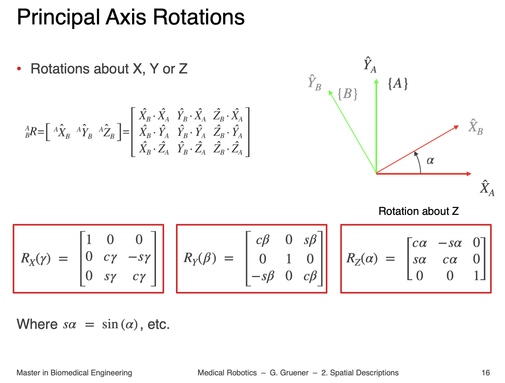
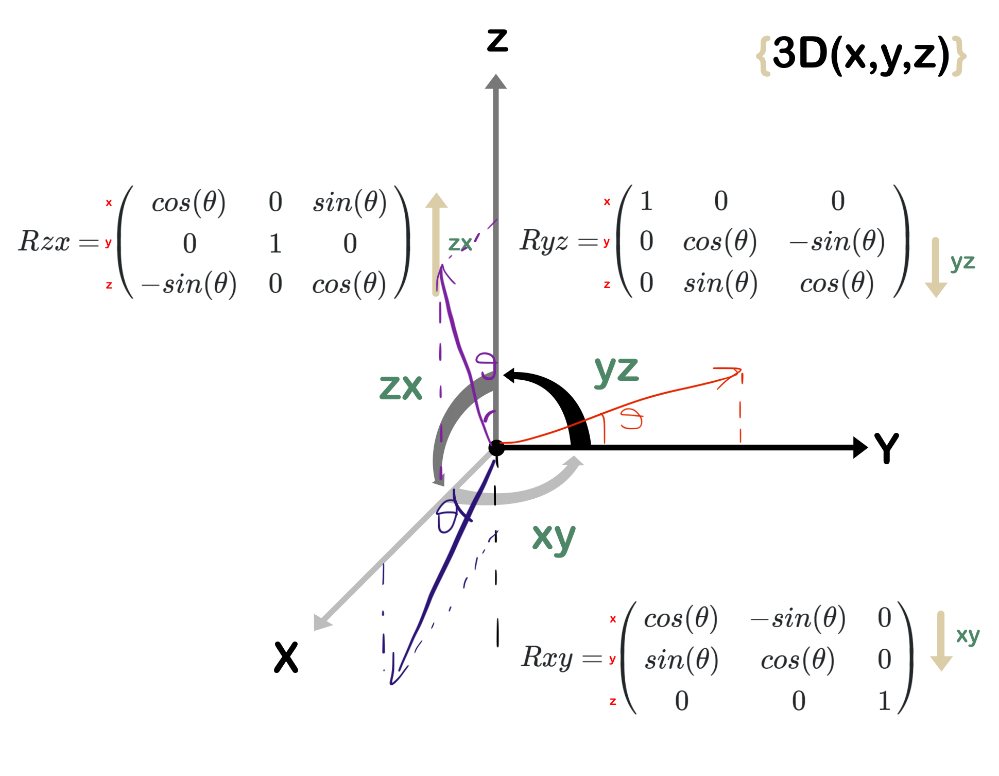

Problem arose from `BME - Medical Robotics - 2 - Spatial Descriptions - Slides`

- First, why do minuses appear? From a mathematical point of view, rotation matrices are skew-symmetric, i.e. $$R^T = R^{-1}$$. [[$$R^{-1}$$ equals replace $$\theta$$ with $$-\theta$$::srs]] So it is not possible to define a rotation matrix without minuses or zeros appearing on non-diagonal elements.

- And the convention of these rotation matrices follow the same positive direction of rotation as the cross product in a [[right handed coordinate system::highlight]].
- See the picture below 
- when considering the rotation in YZ plane along x-axis, original unit vector along y is mapped to the red vector i drew. It is easy to see the coordinate for it is $$[0, cos(\theta), sin(\theta)]^T$$. However, if we look at the rotation in ZX plan along y-axis, the original unit vector along x-axis is mapped to the dark-blue vector and its coordinates is  $$[cos(\theta), 0, -sin(\theta)]^T$$, and the unit vector along z-axis is mapped to the purple vector whose coordinates is  $$[sin(\theta), 0, cos(\theta)]^T$$. Therefore we get the whole $$R_{zx}$$ matrix.
- Another way of thinking is that just look at the axis, a 90° rotation around the x-axis maps the y-axis to the positive z-axis and the z-axis to the negative y-axis; a 90° rotation around the y-axis maps the z-axis to the positive x-axis and the x-axis to the negative z-axis; a 90° rotation around the z-axis maps the x-axis to the positive y-axis and the y-axis to the negative x-axis.

This explains why the rotation along y-axis looks clockwise while the rotation along x and z-axis are counterclockwise.

