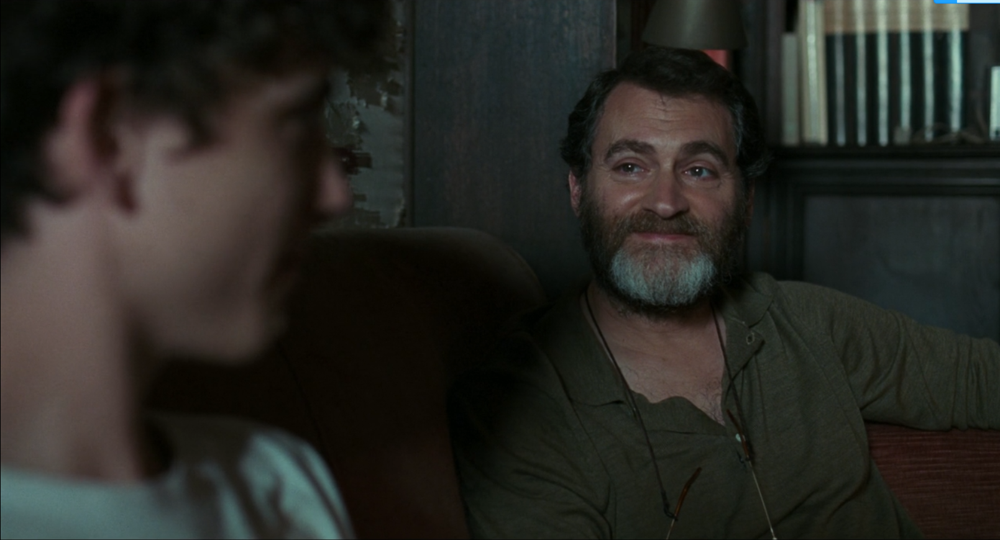

# Agents of S.H.I.E.L.D. Episode 12 

{:.serif .oblique}
What I told her, shattered her world. Her lifelong search led to stories of murder, and now it's too difficult to continue. Her search is over, her story ends here. But you know what she said?

 [[这么多年，她以为自己遭人嫌弃，孤苦漂泊。每一个收留她的家庭都希望她快走，也不关心她。但原来是神盾局在一直保护她，照顾她。这才是她听进心里去的部分 —— 不是她永远也找不到的亲生家人，而是这个一直伴她左右的大家庭。我告诉了她一件足以让她觉得万籁俱灰的事，但不知怎么，她却让我的伤痛有所减轻。这世间充满了邪恶、谎言、痛苦和死亡，对此你无处可逃，你只能面对。关键在于，当面对这些时，你会怎么做，你会成为什么样的人。::rmn]]

{:.serif .oblique}
[[Agent May::lsn]] Tell me. 

{:.serif .oblique}
[[Agent Coulson::lsn]] She said no -- her story started here. Her whole life, she thought she wasn't wanted, that she didn't belong, that every family that took her in didn't want her to stay, didn't care. But all that time, it was S.H.I.E.L.D. protecting her, looking after her. That's what she took away from the story -- [[not the family she'll never have but the one she's always had::highlight]]. Here I am, telling her somthing that could [[destroy her faith in humanity::highlight]]. And some how she managed to repair a little piece of mine. The world is [[full of evil and lies and pain and death, and you can't hide from it -- you can only face it.::highlight]] The question is, when you do, how do you repond? Who do you become?

[[It's a bit ironic. Watched roughly half season and gradually fell in love with S.H.I.E.L.D., but later only to find that it had been infiltrated into a sieve by Hydra and collapsed suddenly...::wrap]]

# Call me by your name

**The dad’s monologue**

{:.serif .oblique}
When you least expect it, nature has cunning ways of finding our weakest spot. Just remember I’m here. Right now, you may not want to feel anything. Maybe you’ll never want to feel anything. And, maybe it’s not to me you want to speak about these things, but I feel something you obviously did. 

[[在最措手不及的时刻，自然总是狡猾地找到我们的致命软肋，但记住，我在。现在你或许想斩断一切情愫，再也不想有任何瓜葛，也许你不想和我聊这些，不过，坦然接受曾经的情感吧，你们有过一段美好的友谊，或许超过了友谊，我羡慕你。我想，多数父母只会希望这种事情烟消云散，祈祷孩子能恢复正常，可我不是这种家长。为了所谓的尽快痊愈，我们压抑了自己太多天性，以致年岁未及而立心却早已枯竭。每当踏入新的感情，能付出的情意就越发淡薄，但若只为麻痹自己不为情所困，何其浪费。我是不是说的太多了，那我就再多说点，你就明白了。我有过类似的感触，却从没体会过你们这样的感情，总有些事让我犹豫，或是阻碍着我。如何生活取决于你，只要记住，我们的内心和身体，都是无二的赏赐，而不经意间，你的心便已枯竭。至于身体，总有一天，会再无悦者，更别说有肌肤之触。此时此刻的悲伤和痛苦，不要扼杀掉，与痛携手而来的，是你经历的快乐。::rmn]]

{:.serif .oblique}
Look, you had a beautiful friendship. Maybe more than a friendship. And I envy you.

{:.serif .oblique}
In my place, most parents would hope the whole thing goes away, or pray that their sons land on their feet. But I am not such a parent. We rip out so much of ourselves to be cured of things faster that we go bankrupt by the age of 30 and have less to offer each time we start with someone new. But to make yourself feel nothing so as not to feel anything—what a waste!

{:.serif .oblique}
Have I spoken out of turn? And I’ll say one more thing… it’ll clear the air. I may have come close, but I never have what you two have. Something always held me back or stood in the way. How you live your life is your business. Just remember, our hearts and our bodies are given to us only once, and before you know it, your heart’s worn out. And as for your body, there comes a point when no one looks at it, much less wants to come near it. Right now, there’s sorrow, pain; don’t kill it, and with it, the joy you’ve felt.

