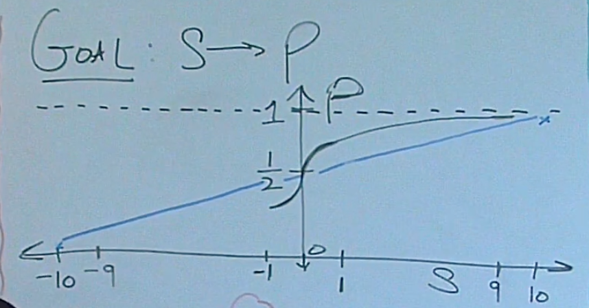

## Sigmoid

- Goal: mapping values of $$(-\infty, -\infty)$$ to probability (0, 1)
- Issues: why a linear function of $$y = \frac{1}{20}x + \frac{1}{2}, x \in [-10,10] $$ not working?
  - can not deal with $$x \lt -10$$ or $$x \gt 10$$
  - **RATE** of **CHANGE**: small change around $$x=0$$ means a lot, so we want a big changing rate here; on the other hand, $$x = 9$$ or $$x=10$$ doesn't give much information for predicting y, so it is more flat towards both ends.
    <!--  -->
    see scratch[[  ::srs]], sigmoid jump at 0

$$ p(s) = \frac{1}{1 + e^{-s}} $$

$$ \frac{dp}{ds} = \frac{e^{-s}}{(1 + e^{-s})^2} = \frac{1}{1 + e^{-s}} \frac{e^{-s}}{1 + e^{-s}} = p(1-p) $$

  
## Softmax

softmax is essentially a multi-dimensional sigmoid (have more than two classes that we're trying to predict)

- Goal: $$S_i$$ to $$P_i$$ under $$P_i \in [0,1], \sum_{i}{P_i} = 1$$
- Idea1: 
  
$$ P_i = \frac{S_i}{\sum_k{S_k}} $$

- Issues: 
  - some $$S_k$$ might be negtive --> e to the power of anything is going to be positive
  - e.g. [0, 1, 2] -> [0, 1/3, 2/3] but [100, 101, 102] -> [0.33, 0.33, 0.34] this no good, we would like our final probabilities to be invariant whether or not we add or subtract some constant from all the entries, b.c. relative differences stay the same

$$ P_i = \frac{exp(S_i)}{\sum_k{exp(S_k)}} $$

$$ P_i^{'} = \frac{exp(S_i + c)}{\sum_k{exp(S_k + c)}} = \frac{exp(S_i) e^c}{\sum_k{exp(S_k)} e^c} = P_i $$ 

$$ \frac{\partial P_i}{\partial S_i} = \frac{(\sum) exp(S_i) - (exp(S_i))^2}{(\sum)^2} = P_i - (P_i)^2 = P_i(1-P_i) $$

$$ \frac{\partial P_i}{\partial S_j} = \frac{exp(S_i)(-exp(S_j))}{(\sum)^2} = -P_i P_j $$

consider the partial derivatives when $$P_i, P_j$$ close to 0 , 1 or 1/2, it is trival.