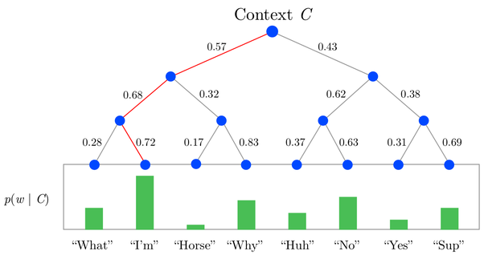

Hierachical Softmax(HS) is technique that you can apply to any neural network that has the softmax functions as its activation function on the output layer(approximating the softmax function), which can greatly reduce the conmputing cost of training a word2vec model.

For basic softmax function see [[Sigmoid and Softmax function]].

The reason why normal softmax not eligible to word2vec is because in expression $$ e^x / \sum{e^x} $$ when we update the activation value for one output, we also have to compute all preactivations in $$\sum{e^x}$$. That is computational cost `|V|`. This works well in small image classification task like MNIST which only has 10 outputs. For word2vec it can be over 100,000. Using HS this computational cost can be reduced to $$log_2(V)$$. HS is done by utilises a multi-layer binary tree, where the probability of a word is calculated through the product of probabilities on each edge on the path to that node.

Youtube explain of [[Hierarchical Binary-Tree Softmax::https://www.youtube.com/watch?v=B95LTf2rVWM]]