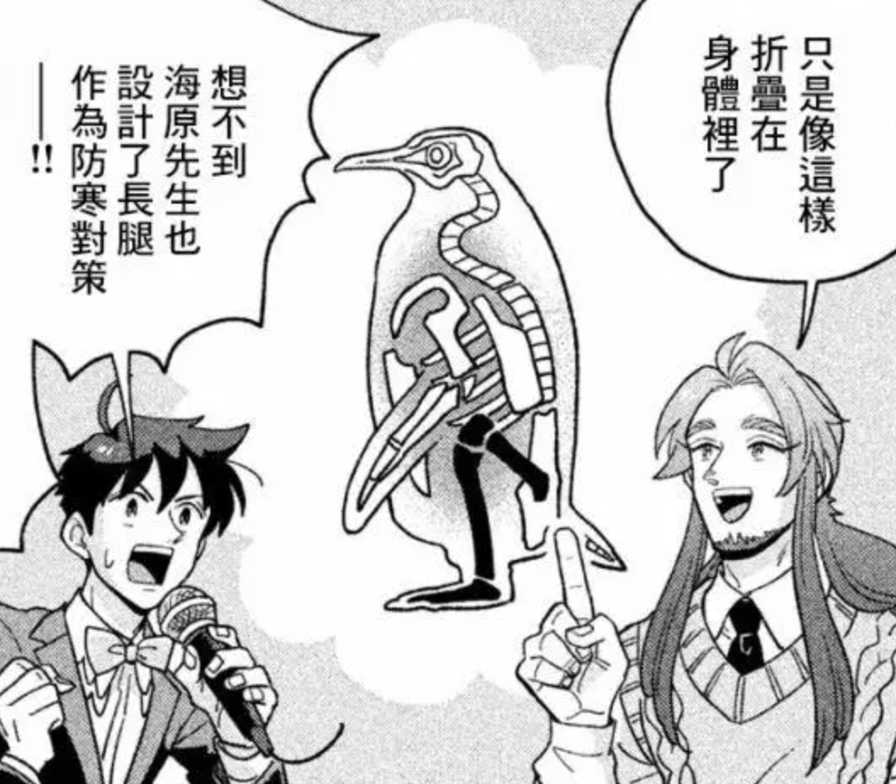
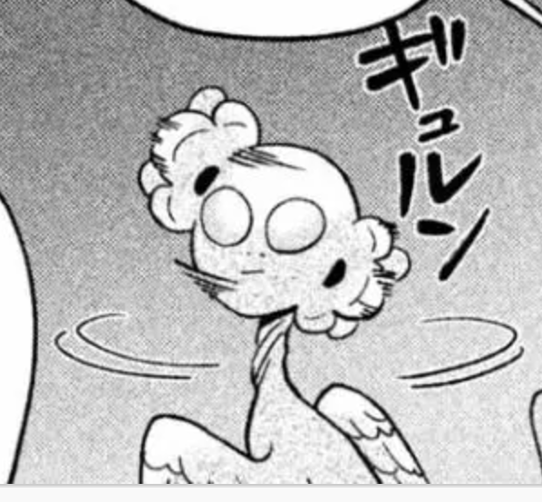
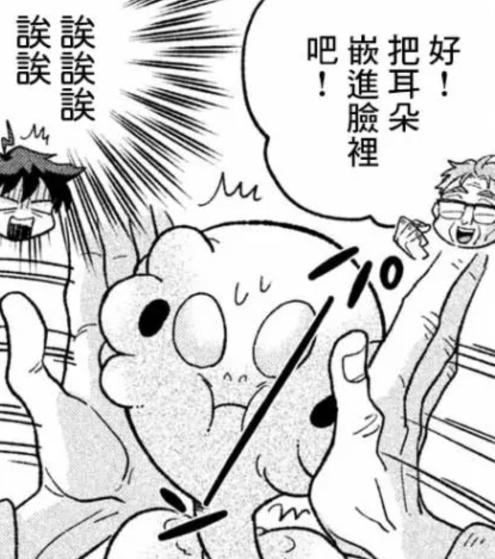
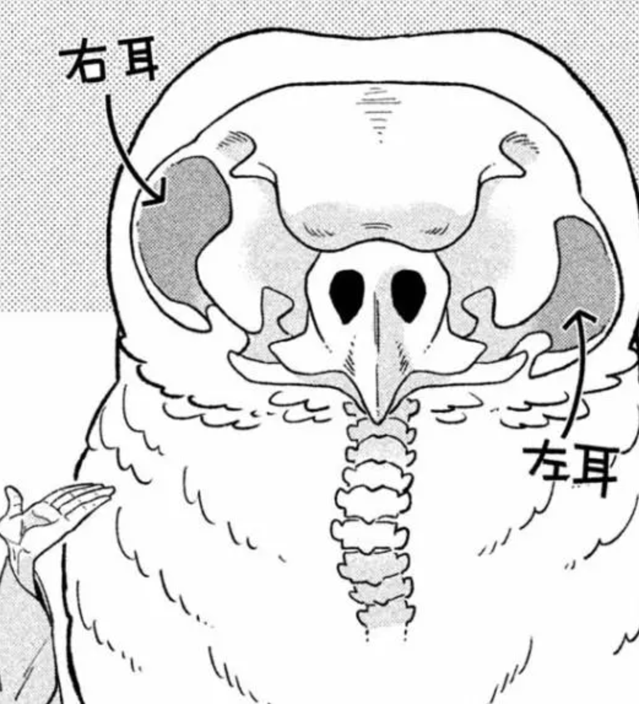

# 企鹅 -- 常年蹲着的鸟

 | 企鹅[[图：天地创造设计部/第26话::rsn]]虽然看起来是只腿短的憨憨但其实人家只是蹲着。。他们的关节固定为弯曲的状态，通过这种构造可以防止脚接触冰面是血液快速冷却。至于为什么不进化成直立的大长腿，因为企鹅不光要陆上行走还得海里游泳，要是变成大长腿在海里自由泳的话一样会因为腿部接触面积过大而失温。

 PS：为了不放走捕的鱼，企鹅的舌头上全是倒刺，看起来相当恐怖（自然界很多看起来可爱的东西其实远非如此，最典型的例子大概是**考拉**，可能之后会写到）他们留鼻涕是为了保持体内水盐平衡，而且明明是鸟类却是变温动物。（是不是一点也不可爱了。。。

# 海龟产卵很痛苦所以流泪？ -- 瞎扯

总有些感情丰沛的文艺青年要说海龟为了生存不惜上岸下蛋甚至痛哭流涕，都是扯淡，谣言就是这么产生的。海龟她一卵生动物，生育能有人类痛苦？话说若是人类也能和著名的卵生哺乳动物鸭嘴兽一样下蛋，中国日渐堪忧的生育率会不会有点救（我是觉得没必要哈哈哈中国人本来就太多了，减轻一下人口密度造福下下代吧）

扯远了，海龟之所以流泪最大的原因和企鹅留鼻涕一样，都是控制体内水盐平衡。他们通过饮用海水生存，眼睛后部的泪腺则将多余的盐分混合在眼泪里排出去，海龟在海里也一直在“哭”只是我们看不出来而已。

# 耳朵好使的动物 -- 猫头鹰

  |   |    |   

 左边[[图：天地创造设计部/第25话::rsn]]那俩恶心吧啦的东西是猫头鹰的“设计”雏形...是不是有了毛一切都变得不一样了

猫头鹰眼睛周围圆形凹陷的部分叫做面盘，起类似抛物面天线的作用，将声音集中到耳朵，同时耳穴在正面也增强了收音功能，不过也正因如此，它需要可以360度自由旋转的长脖子来弥补必须超向声音来源才能听清的缺点，而耳朵嵌进去是因为这样即使脑袋转成拨浪鼓远看整体轮廓也不变，增加隐蔽性。

猫头鹰耳朵的位置左右上下错开，是造物主天才的设计（神奇的进化），不但可以通过声音先传到左右耳判断声音的来源方向，还可以根据左上右下的耳朵位置判断声音的高度。猫头鹰飞羽为锯齿状，通过切断空气可以降低翅膀扇动的声音。

PS：于此相对的，**大象**虽然耳朵很大但其实耳朵非常不好使，扁平的耳朵没有抛物线收音效果，那纯属就是两块散热片，大象靠用力踩地面骨传导听声。