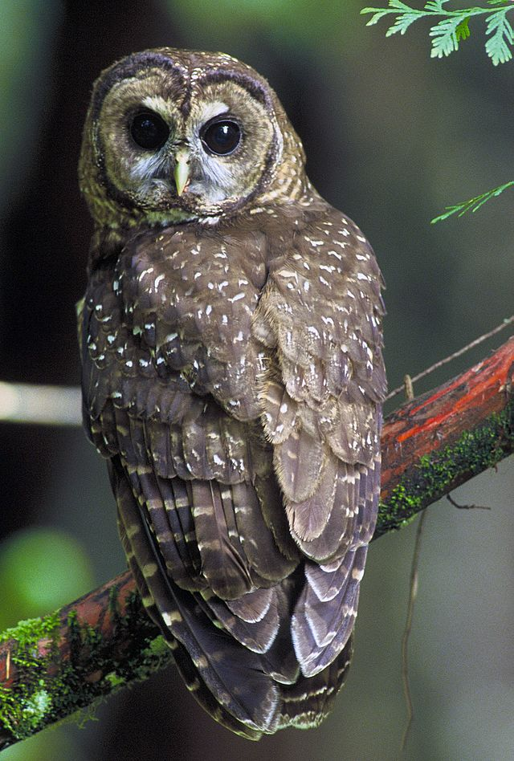

What a strange animal! Notes for「天地創造デザイン部」 Biological Encyclopedia / bio-illustration

# 常年蹲着的鸟 -- 企鹅

 | 企鹅[[图：第26话::rsn]]虽然看起来是只腿短的憨憨但其实人家只是蹲着。。他们的关节固定为弯曲的状态，通过这种构造可以防止脚接触冰面是血液快速冷却。至于为什么不进化成直立的大长腿，因为企鹅不光要陆上行走还得海里游泳，要是变成大长腿在海里自由泳的话一样会因为腿部接触面积过大而失温。

 为了不放走捕的鱼，企鹅的舌头上全是倒刺，看起来相当恐怖（自然界很多看起来可爱的东西其实远非如此，最典型的例子大概是 [考拉](#koala) ）他们留鼻涕是为了保持体内水盐平衡，而且明明是鸟类[[补充一个冷知识，**鸟不怕辣**。辣椒素会作用于哺乳动物感知疼痛和温度的神经纤维，而鸟类的体内缺乏对辣椒素敏感的受体，鸟类在吃辣椒时既不会破坏辣椒的种子，也不会受到辣椒素的影响。而相对的，通过鸟类的长距离的飞行，辣椒就把自己的种子撒播到世界各地。::rsn]]却是变温动物，而且骨头是实心的增强重量便于潜水。（是不是一点也不可爱了。。。

# 耳朵好使的动物 -- 猫头鹰

  |   |    |   

 左边[[图：第25话::rsn]]那俩恶心吧啦的东西是猫头鹰的“设计”雏形...是不是有了毛一切都变得不一样了

猫头鹰眼睛周围圆形凹陷的部分叫做面盘，起类似抛物面天线的作用，将声音集中到耳朵，同时耳穴在正面也增强了收音功能，不过也正因如此，它需要可以360度自由旋转的长脖子来弥补必须超向声音来源才能听清的缺点，而耳朵嵌进去是因为这样即使脑袋转成拨浪鼓远看整体轮廓也不变，增加隐蔽性。

猫头鹰耳朵的位置左右上下错开，是造物主天才的设计（尽管看起来有点像外星生物），不但可以通过声音先传到左右耳判断声音的来源方向，还可以根据左上右下的耳朵位置判断声音的高度。猫头鹰飞羽为锯齿状，通过切断空气可以降低翅膀扇动的声音。

PS：于此相对的，[[大象::highlight]]虽然耳朵很大但其实耳朵非常不好使，扁平的耳朵没有抛物线收音效果，那纯属就是两块散热片，大象靠用力踩地面骨传导听声。

# 极简实用主义的杰作 -- 蛇

前足、后足？通通不需要。交配的洞和排泄的洞？合并成一个泄殖腔。仅通过绳状身体就可以进行匍匐前进，腹部的锯齿可以钩住木头表面从而攀爬上高大树木，捕捉猎物后收紧绳状身体可以令其窒息。而且还拥有特殊的嗅觉，用舌头感知空气中的气味分子，当蛇在猎物附近伸舌头时是在“闻”气味。

# 关于味道

一般来说，吃植物或者吃虫的动物都很好吃。肌肉越少，肉质就越柔嫩；动作迟缓的动物体内有更多的不饱和脂肪酸，吃起来会有融化般的口感。

肌肉的种类也会有影响，e.g. 鸡腿上的肌肉（红肉[[红肉之所以红是因为这类肌肉的新陈代谢必须支持长期持续的运动，这要求肌细胞线粒体要合成大量ATP。而名为肌红蛋白的含铁蛋白质负责将氧气从血液中输送到肌细胞的线粒体中，他们的大量存在使得肌肉呈现暗红色（PS：由于线粒体利用脂肪合成ATP，红肉会比白肉油腻）::lsn]]）是慢缩肌纤维slow-twitch muscle / oxidative muscle，或I型肌肉，是一种不易疲劳的肌肉。而鸡胸上的肌肉（白肉）是快缩肌纤维fast twitch muscle，又叫II型肌肉，是一种爆发力强但很快松弛的肌肉；II型吃起来更干巴巴更柴一些[[马拉松运动员比短跑运动员更好吃（开玩笑XD::rsn]]。

# 筑巢狂魔 -- 织巢鸟

 | 由于被不折不扣的挑食大王 -- [[非洲食卵蛇::highlight]]疯狂跟踪，群居织巢鸟会齐心协力制作出左图这样的迷宫巢穴，他们的巢是吊在树枝上的袋子形状，入口位于蛇不易进入的下方。

# 海龟产卵很痛苦所以流泪？ -- 瞎扯

总有些感情丰沛的文艺青年要说海龟为了生存不惜上岸下蛋甚至痛哭流涕，都是扯淡，谣言就是这么产生的。海龟她一卵生动物，生育能有人类痛苦？话说若是人类也能和著名的卵生哺乳动物鸭嘴兽一样下蛋，中国日渐堪忧的生育率会不会有点救（我是觉得没必要哈哈哈中国人本来就太多了，减轻一下人口密度造福下下代吧）

扯远了，海龟之所以流泪最大的原因和企鹅留鼻涕一样，都是控制体内水盐平衡。他们通过饮用海水生存，眼睛后部的泪腺则将多余的盐分混合在眼泪里排出去，海龟在海里也一直在“哭”只是我们看不出来而已。

# 藤壶
有碍观瞻，想看的点开
[[藤壶是世界上阴茎最长的生物，有身体四倍之长。顺便一提，他的长阴茎在甲壳中会收纳成卷发状，而且雌雄同体可以自己产卵（这到底什么玩意，~~它大概可以水仙的很开心~~::srs]]

# 出乎意料的不可爱 -- 考拉

  | 考拉的食物是有毒的桉树叶[[桉树：我特么又没营养味道又苦怎么还能被啃？？::rsn]]，为了方便消化有长$$2m$$的富含各种细菌的盲肠。和袋鼠一样腹部有口袋但是是倒过来的, 方便吃母亲的被叫做pap的未消化的💩来接收消化桉树叶所需的微生物。他们爪子锋利，眼睛是像猫一样的竖瞳, 声音是有震慑力的死亡嗓音（通过声音争斗） [[雄性有两根阴茎，雌性有两条阴道::srs]]。纯纯是除了欺骗性的外表之外没一点可爱之处orz

# 迷之性癖 -- 长颈鹿

据说交尾的两只长颈鹿九成都是gay，他们会在用头部打架后热烈交尾，还喜欢饮用雌性的尿液(**WTF？？**)。仅靠植物无法摄取足够蛋白质时还会食用小动物，比如鸽子。（长得高就是好啊，站着打鸟。。

# 不惜患上骨质疏松症 -- 加拿大马鹿

不论对什么动物来说，角都是奢侈品，骨头是像用钙质当砖头造的房屋，而角是把房子的砖抽出来做的。加拿大马鹿雄性在一年中的某几个月为了长出巨大的角，会借用体内的骨头中的钙质，导致患上骨质疏松症。幸好，鹿有四个胃，通过大量进食得以摄入充足营养，而且鹿的消化能力很强[[鹿消化能力强的显征之一是排泄物看不出原形，而像**马**吃下去的东西都没怎消化，排泄物能看出原来的形状::rsn]]，连很硬的东西都能吃，最终恢复健康的状态。如果鹿身体状况不好，长出的角也会较小，在向雌性展示健壮程度的斗争中会落败。

综上所述，**独角兽**是无法存在的，最多就是在牛那样健硕的身躯上装个角，其结果一点不像传说中帅气的独角兽反倒肖似末世文里的变异动物。。。 [[一角鲸::highlight]]的存在已经是奇迹了（

# 睁着一只眼睛睡觉 -- 海豚

 | 把河马的眼睛移到侧面[[高速游泳的时候如果眼睛在正面会很痛::rsn]]，鼻子移到上面[[防止向前运动时海水灌进去::rsn]]，去掉耳朵，你会得到什么？答案是海豚，尽管河马长得像猪，但是他们其实是海豚的近亲。与一般哺乳动物不同，海豚的左右脑是独立的，所以海豚睡觉的时候只闭一边眼睛，而且不会溺水。海豚使用声波定位，其原理与声纳相同：动物向周围环境发出短暂而强烈的声波，其中部分声波被障碍物反射后被动物接收。信号发射和接收的时间表示发射器和目标物体间的距离。反馈信号的波形和强度进一步显示出目标物体的形状和大小。

# 海马 -- 如何定义雌雄？

海马是地球上唯一一种靠雄性生育后代的物种雄性有着叫做腹囊的口袋，在此行产下的卵孵化成鱼苗前保护着它们。雄性腹部圆圆的，有着供后代钻出的洞。而腹部粗糙不平的是雌性。雌雄用来插入雄性体内的像**一样的东西是输卵管，平时收在体内。那么为什么被插生娃的那个反而叫雄性呢？在两性参与繁殖动物中，提供精细胞的称为雄性，提供卵细胞的称为雌性。所以，虽然小海马是雄性海马所生，但它提供的是精细胞，因此它依然是雄性。（类似“代孕”）
