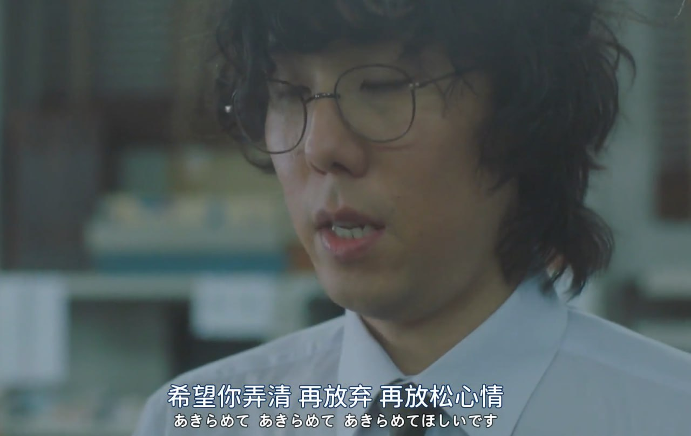
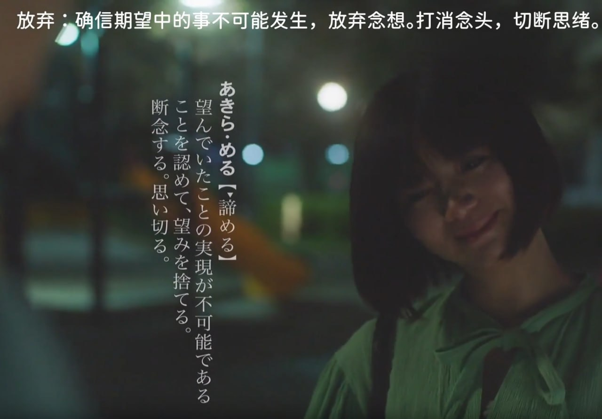
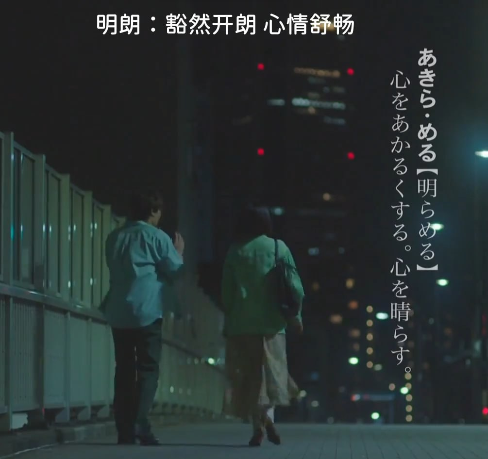

「諦める」の語源は「明らむ＝明らかにする」

日语很有意思，放弃(あき​らめる)和知晓明亮(あき​らか)是一个词源。而且放弃中的汉字「諦」仏教では「真理、道理」の意味。看起来很像是是日本消极文化的缩影, 但也未尝没有道理，正所谓退一步海阔天空, 身在局中枷锁缠身自是焦虑困苦不得排解，走出来或许能看见另一条明路。

很多事情一体两面（多面），相手这个词也很好玩，既是对手（敌人）也是对象（爱人）还是伙伴（友人）。大河民族把相爱相杀玩的明明白白（XD

2024.02.29补充：
日剧《编舟记》第二集马缔对岸边说 "あきらめて あきらめて あきらめて ほしい です",第一遍岸边以为是”希望你放弃、放弃、再放弃“ 是要我拼命放弃吗？就很搞笑，实际查了字典才发现是同音字，“希望你弄清、放弃、再放松心情”。

