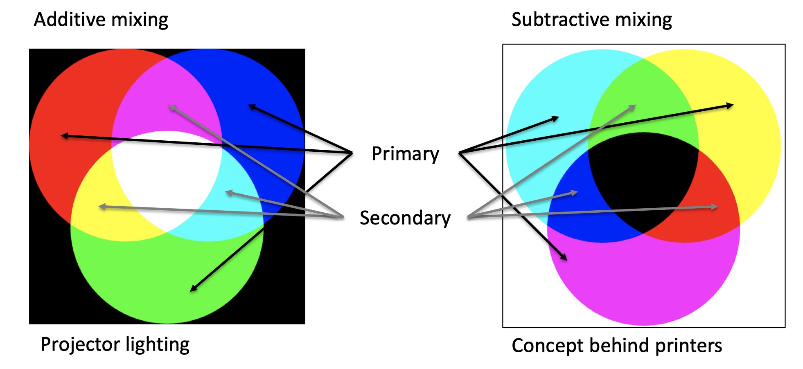

I have always heard a saying that the three primary colors of light are red, green and blue, and the three primary colors of paint are red, yellow and blue. When I used to paint gouache, I also knew to use red, yellow and blue pigments to make other colors, but why the concept behind printers are cyan, magenta and yellow?

In order to explain this problem, we first need to know that people can see colors because they see the light reflected by objects. There are three types of nerve cells that can produce color perception in the human eye, and they are most sensitive to light with wavelengths near values of 420 nanometers, 534 nanometers, and 564 nanometers, which respectively cause the brain to produce three color senses: blue, green, and red. If the blue and green receptor cells are stimulated at the same time, the sensation of cyan is produced, and if three cells are stimulated similarly, we perceive gray or white.

Take an object under sunlight (full color spectrum) as an example, the object itself does not emit light. If an object is red, it is because it absorbs most of the wavelengths of light, leaving only the light that can make people feel red. In terms of the three-primary color model, it absorbs blue and green light and reflects red light.

If a printer uses RGB model, each ink actually absorbs two colors and reflects one color. In this way, there is no problem in printing red, yellow and blue monochrome (only one ink be used alone). But if you want to print yellow, the problem arises. It is reasonable to add red light and green light to produce yellow, so we should mix red ink and green ink, in which red ink will absorb blue-green light and reflect red light, and green ink will absorb red and blue light, reflecting green light. These two inks are added together to absorb blue light, but part of the red light reflected by red ink is also absorbed by green ink, and part of the green light reflected by green ink is also absorbed by red ink. Although there may be some remaining part of red and green light makes yellow, the color must be very dim. So if you use RGB ink, because each ink absorbs two color and reflects one color, the more ink you use, the more light will be absorbed. Thus it is difficult to print bright colors.

[[使用RGB模型下混合两种油墨，吸收没有问题，但是剩下一种该反射的颜色光也被两种墨互相吸收，抵消了一部分；而CMY模型下，虽然两种油墨仍会互相吸收抵消，至少双方都反射的那种颜色不受影响。::rmn]]

But what if we do it reversely? Let each ink to absorbs one color and reflects two color? In this way, we get cyan **(C)**: the ink that only absorbs red and reflects blue and green, magenta **(M)**: the ink that only absorbs green and reflects red and blue, and yellow **(K)**: the ink that only absorbs blue and reflects red and green. In this case, if the cyan ink and the magenta ink are mixed, the blue is not absorbed by the two inks, so the reflection strong. The red may be completely or partially absorbed by cyan ink, and the green may be completely or partially absorbed by the magenta ink, but anyway, blue is left unaffected, so you get brighter colors.

To conclude, in comparison, the printed matter obtained by using RGB ink will be darker, whereas by using CMY ink can be relatively brighter. The light is same all the time, you cannot turn dark into bright, but it is easy to turn the bright into dark -- just add some black ink **(K)**. That is why printing use CMYK.