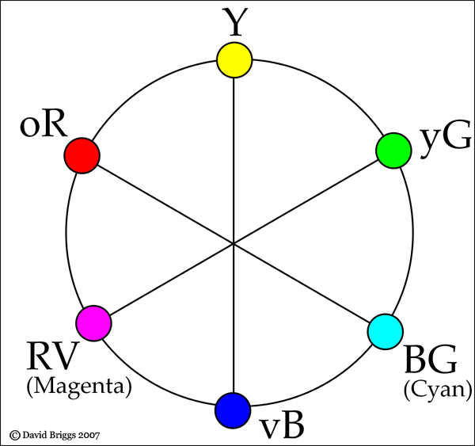

HSV model depends upon the human perception, and if you don't know what it is, we can start from RGB model. 

The left figure shows a RGB cube. If we look at this cube from the white vertex to black vertex angle, we get a Hexagon in which all the six colors(3 RGB colour + 3 CMY[[Why do printers use the CMY color model instead of RGB?::rmn-transclude]] color) from that cube's vertex have different angles, and they are seperated each by 60 degrees. We can also twist the hexagon a bit to get a RGB-CMY hue circle. This is what we always saw as the pure colour top layer of a HSV cone.

  |  | 

  | **HUE** represents the angle of rotation around the vertical axis, it describes pure color, range $$[0, 360^{\circ}]$$ **Saturation** is how far away from the vertical axis, it describes how much a pure color is diluted by mixing white color, range $$[0, 100\%]$$.  **Value** is indeed from the vertical(V) axis, it decides the brightness of the color, range $$[0, 1]$$, V = 0 means black color and V = 1 means white color. 

Note: just to clarify 

  | **HSV**(for hue, saturation, value) and **HSB** (for hue, saturation, brightness[[OMG  brightness 和 lightness 有个鬼区别啊!!::rsn]]) are the same thing.    **HSL**(hue,saturation, Lightness/Luminosity/Luminance) and HSI (Hue, Saturation, **Intensity**) are the same thing.    But HSV/HSB $$\neq$$ HSL/HSI. 