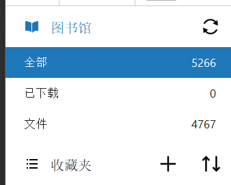
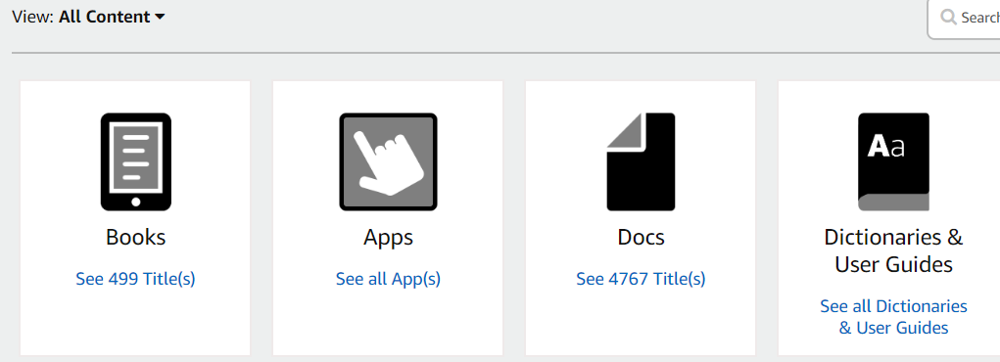
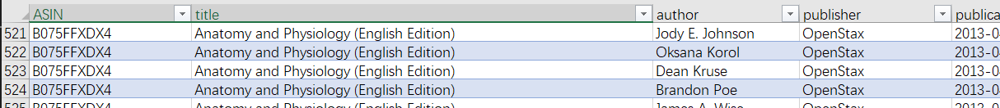
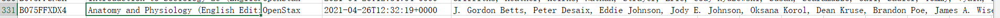

Export your kindle personal documents lists to excel files (csv)

我有好几个亚马逊账号，美国、德国、日本、还有快报废的中国区，每个账户里面都有一堆漫画小说，多的有几千本。想看的时候实在是很难记清当时存在哪里，而登录每个亚马逊账户去manage content里面找非常不方便（亚麻响应速度还很慢）。所以把个人文档内容列表导出来能省很多事，当然你不看漫画的话我觉得应该不会有这个麻烦哈哈哈哈

- 下载kindle for PC，登录账户之后记得同步，当你看到左侧统计数目和亚马逊网页里计算之和差不多时说明同步完毕，数据可能会有微小差别源于字典guide。

 |   

- 然后打开windows run程序输入appdata，点击确定后依次进入`...\Local\Amazon\Kindle\Cache`文件夹，关闭kindle应用后会看到`KindleSyncMetadataCache.xml`，这就是同步之后得到的数据库文件了。这时你可以选择用excel直接打开as an XML table，但是会出现一个问题，如果一本书有多个作者，表格中会出现多包括每一个作者的行造成冗余，强迫症患者表示不能忍。如图，此时我已经移除了synctime，pronounciation等无用列。



PS：Mox/Kox.moe推送的漫画即使多作者也是一行的，似乎网站本身没有做分隔符处理。但是亚马逊自己的书反而有这个智障毛病。。。

如果你觉得这类数据不多的话可以手动在excel里consolidate，但是我数据太多了还是交给机器去做吧

- 将清理过的表格保存为xlsx或csv后导出，在命令行里运行以下[python](../assets/files/consolidate.py)代码
  ```python
  import pandas as pd

    # Load your Excel file into a pandas DataFrame
    df = pd.read_excel('D:/Downloads/Book1.xlsx') # or read_csv

    # Group by book title and concatenate the authors' names
    df_grouped = df.groupby(['ASIN', 'title'])['author'].apply(lambda x: ', '.join(x)).reset_index()

    # Write the grouped data back to Excel
    df_grouped.to_excel('Bookmerged.xlsx', index=False) # or to_scv
```

- 你会得到一个新的去完重的列表，done


- 存在中文情况下,最后导出的excel打开可能有乱码问题，重新选择encoding打开