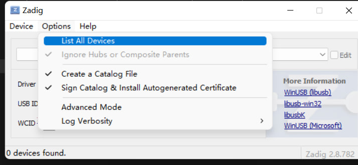
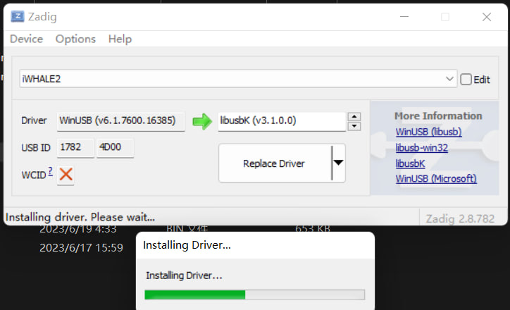
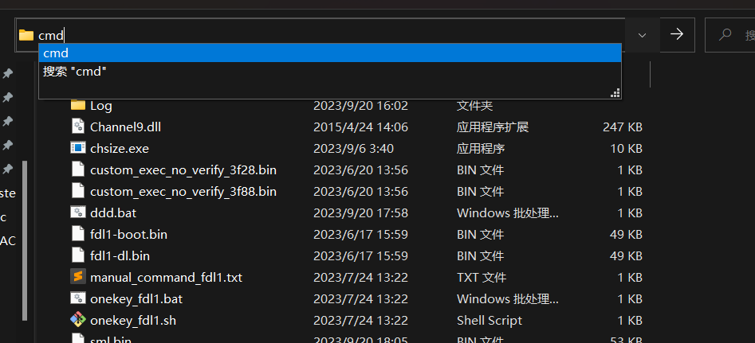
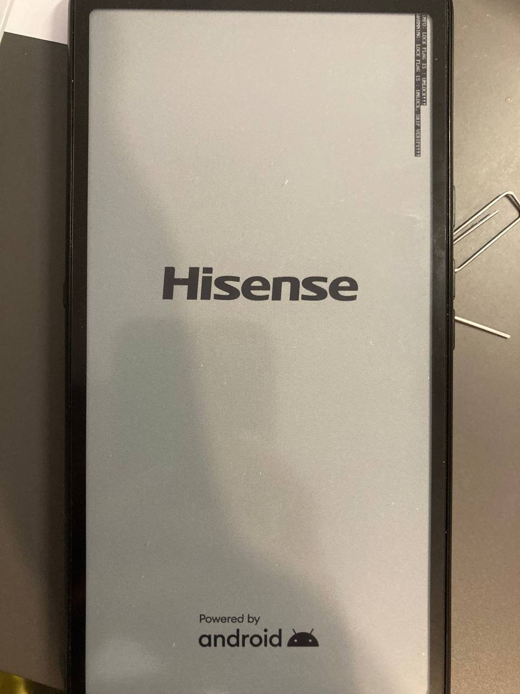
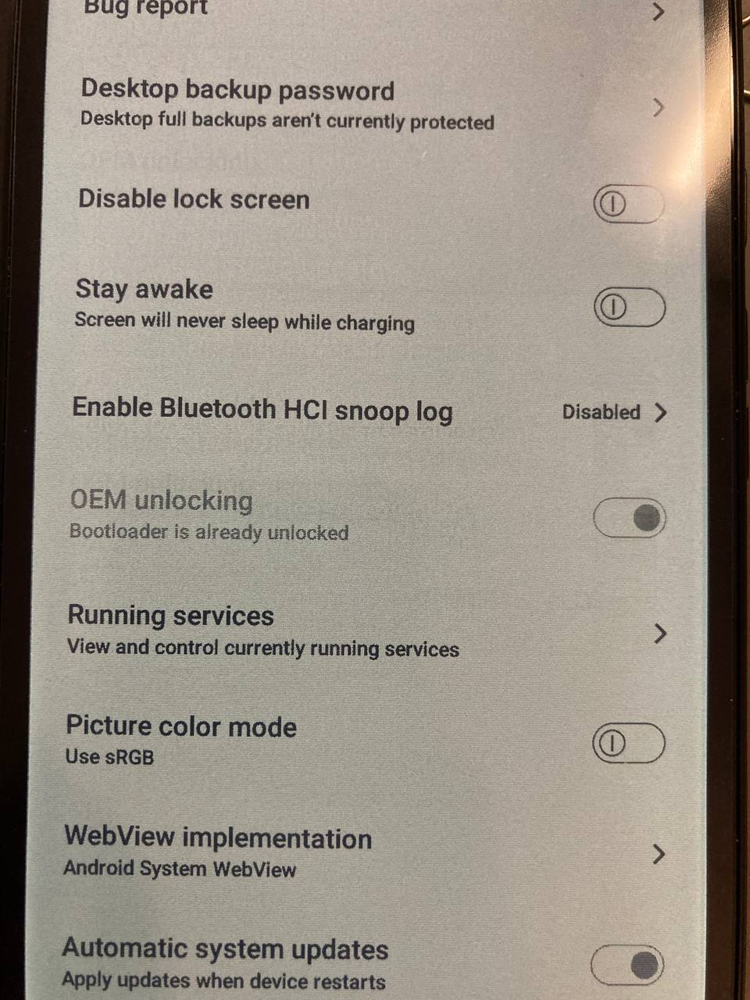
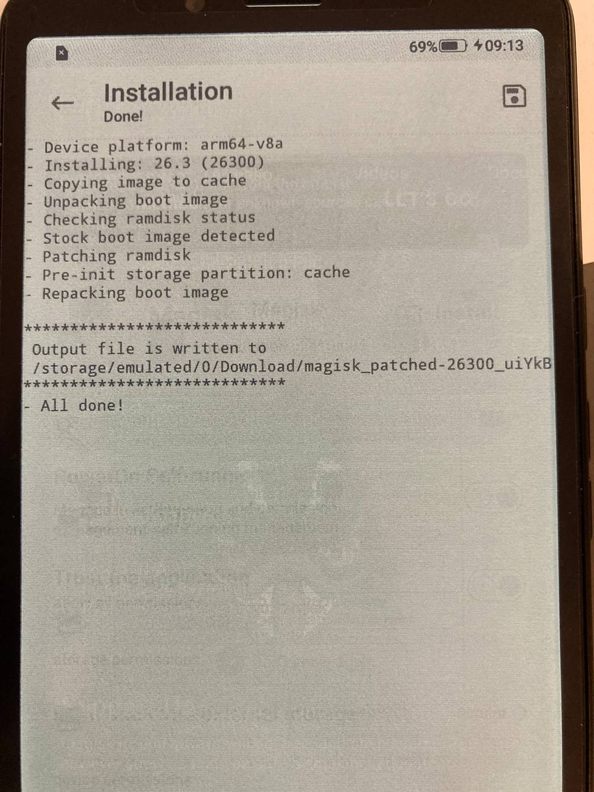
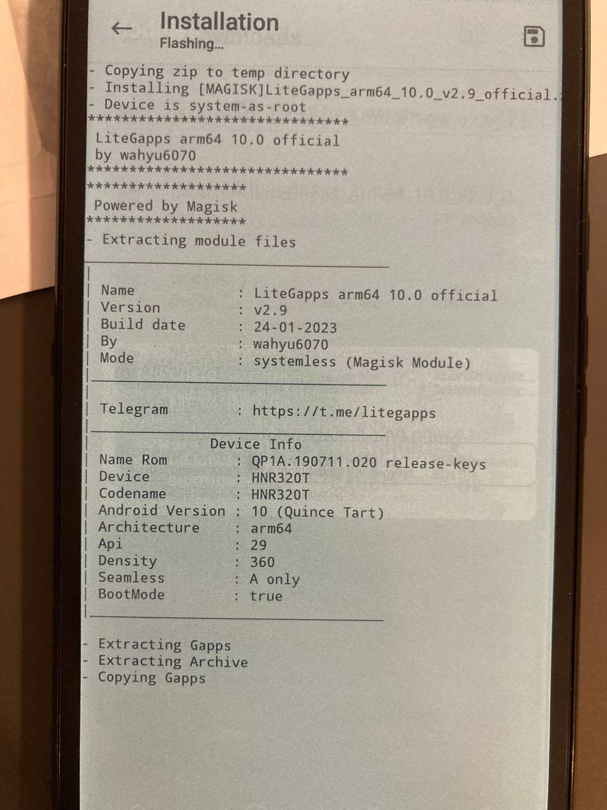

Reference:
    1. [CVE-2022-38694 Unlook Bootloader](https://github.com/TomKing062/CVE-2022-38694_unlock_bootloader)
    2. [Hisense A7CC Full Google Rooting guide](https://www.reddit.com/r/eink/comments/15vqik0/hisense_a7cc_full_google_rooting_guide/?share_id=GuK6Bd5LhSMONrfxtXMrY&utm_content=2&utm_medium=android_app&utm_name=androidcss&utm_source=share&utm_term=1)

折腾一下午后终于搞定了谷歌框架。。国产安卓机真是太麻烦了[[然后发现由于安全问题ubs和postfinance app都无法在rooted设备上使用orz::rsn]]

TomKing的WIKI过于简洁，幸好reddit有稍微全一点的介绍，但是中间还是缺了很多东西全靠猜。。。

记录一下完整破解流程

[[警告！Root操作会抹掉所有数据，务必提前备份::highlight]]

需要工具（以后链接过期的话自行谷歌）：
1. spd_dump 去release页面下载[hisense_a7cc.zip](https://github.com/TomKing062/CVE-2022-38694_unlock_bootloader/releases)
2. [SPD_Driver_R4.20.4201](https://androiddatahost.com/dsa6h)
3. [avbtool](https://github.com/zhuzhizhan/avbtool)
4. [Magisk](https://github.com/topjohnwu/Magisk/releases)
5. [Adbtools](https://developer.android.com/tools/releases/platform-tools)
6. python2
7. [Zadig](https://zadig.akeo.ie/)


#### 打开开发者选项
`设置`-`关于手机`-`内核版本`那一行连续按七次，回到`设置`-`系统与更新`，现在你应该能看到`开发者选项`了。进入后打开`OEM解锁`和`usb调试`选项，将手机连接至pc，下滑通知栏能看到正在通过USB为此设备充电，点击进入后选择`文件传输(MTP)`, 至此手机操作暂时结束。

#### adb reboot
将platform-tools_r34.0.4-windows解压后在该文件夹打开cmd，运行`adb reboot autodloader`。之后手机会变砖，莫慌.

#### Zadig
打开Zadig, Options-List All Devices
, 下拉选择iWHALE2，注意usb id是1782 4D00. driver右侧选择libusbk，replace driver安装。等一会后会显示success。


#### SPD_Driver

解压SPD_Driver_R4.20.4201后对应版本安装。

#### 备份

```
spd_dump exec_addr 0x3f28 fdl fdl1-dl.bin 0x3f28 fdl uboot-mod.bin 0x9efffe00 exec read_part boot 0 35M boot.img reset
```
#### Unlock the bootloader

进入`hisense_a7cc/`，打开命令行（可以直接在当前文件夹地址栏输cmd打开）
, 直接运行`onekey_fdl1.bat`或者一条一条复制`manual_command_fdl1.txt`里的命令。如果中间出现weird/wrong, 同时按住电源键和音量键上下重新进入下载模式。

成功后机器会自动重启，开机界面右上角显示unlock。



如果你错过了观察开机界面的时机，再次进入开发者选择会发现OEM选项灰了，说明unlock成功。


打开usb调试后连接电脑再次运行`adb reboot autodloader`, 用以下命令备份解锁的image.

`spd_dump exec_addr 0x3f28 fdl fdl1-dl.bin 0x5500 fdl uboot-mod.bin 0x9efffe00 exec erase_part uboot_log write_part splloader spl.bin timeout 100000 write_part userdata userdata.bin reset`

成功生成`boot.img`文件，大约35M。

#### Magisk patch

下载Magisk apk，手机连接pc打开usb MTP模式后将apk和`boot.img`复制到Downloads文件夹（别的也行）

进入文件管理器安装Magisk（允许安装未知来源应用），打开选择安装/install， 勾选选择并修补一个文件，选中`boot.img`，, 显示all done即成功。此时download文件夹会出现一个新的文件`magisk_patch-xxx.img`, 把它复制到电脑上。github下载avbtool后解压，在avbtool-master文件夹里新建一个AIK文件夹，将新生成的`magisk_patch-xxx.img`移动进去并改名为`image-new.img`.

之后avbtool的windows教程可以见TomKing062[原始po](https://github.com/TomKing062/CVE-2022-38694_unlock_bootloader/wiki/Magisk)（有中文）

但是我用windows按他的做法运行到`python2 avbtool add_hash_footer --image AIK/image-new.img --partition_name boot --partition_size 36700160 --key rsa4096_vbmeta.pem --algorithm SHA256_RSA4096 --salt 5F55215FD2302D021F850B55912ED48D176784678692DC012E054B1ECD0BE025`时python2会报subprocess的error2错误，折腾了半天没解决。直接移动到macbook做了，mac的python2没报错，可能是我windows装的有点问题。

#### fastboot
运行成功后将新签名好的`.img`复制到adb platform-tools文件夹，打开命令行运行`adb reboot fastboot`.

手机会进入一个黑色界面，使用音量键向下选择reboot to bootloader，电源键确定。然后又会显示那个右上角有unlock小字的界面，运行`fastboot flash boot image-new.img`和`fastboot reboot`. 

#### 安装gapps

到这里差不多就做完了，只剩安装google play商店，下载[litegapps](https://sourceforge.net/projects/litegapps/files/litegapps/arm64/29/lite/v2.9/%5BMAGISK%5DLiteGapps_arm64_10.0_v2.9_official.zip/download), 把下载好的zip文件复制进手机downloads文件夹，注意是zip不是解压后的文件夹！！！

打开Magisk，选择模块/module，从本地安装，选择LiteGapps安装。

重启后你就拥有play商店了


