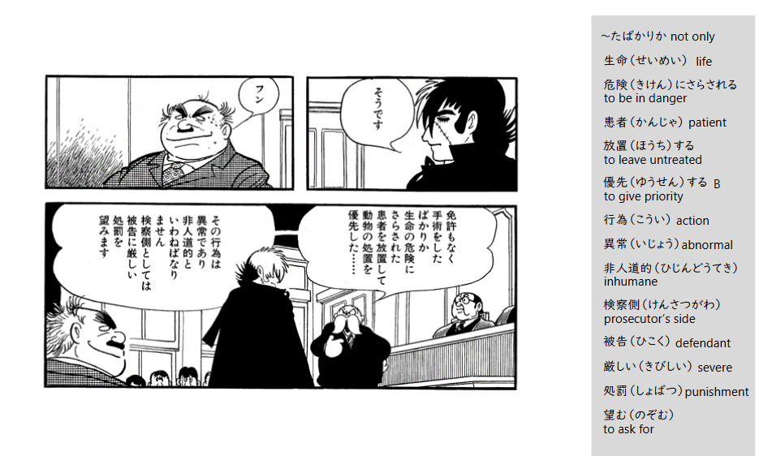

自用记录，内容比较杂，普通的新闻阅读分级阅读，nhk教学网站，视频教材，聊天小组主页，生肉web漫画等都有。[[すべて無料::rsn]]

1. [おしゃべりカフェ リラ](https://sites.google.com/view/oshabericafelila/%E3%83%9B%E3%83%BC%E3%83%A0?authuser=0#h.dh16u12zt2ix)

    北海道的志愿者小组，提供1v1免费日语课，也有多人会话练习，zoom形式。适合练习口语，不需要住在北海道，任何人都可以参加。

2. [Todaku分级阅读](https://tadoku.org/japanese/free-books/)
    
    日语分级阅读 

3. [NHK NEWS WEB](https://www3.nhk.or.jp/news/easy/)
   
   应该都知道

4. [Minato](https://minato-jf.jp/)
   
   推一下里面手冢治虫的漫画那门课，[アニメ・マンガの日本語B1B2（ブラック・ジャック）自習コース](https://minato-jf.jp/CourseDetail/Index/KC24_ANBS_B1B2_JA02), 内容是黑杰克的第一话 手术的顺序。提供了英语备注版，从拟声词、汉字到方言表示都有解释。初学者友好(虽然我不需要也有分镜阅读顺序教学)。

   [[也有マウスオーバー模式，本图为右列显示::rsn]]

5. [Tsunahiro](https://tsunagarujp.mext.go.jp　)

    「生活者としての外国人」のための日本語学習サイト つながるひろがる にほんごでのくらし
    日常生活用语

6. [堀さんと宮村くん](https://dka-hero.me/top.html)
   
   堀与宫村，原版web漫画生肉。

7. [日本語学習番組「ひきだすにほんご Activate Your Japanese!」](www.hikidasu.jpf.go.jp)
   
   [ドラマ「スアン日本へ行く](https://www.hikidasu.jpf.go.jp/jp/corner/drama/)有点像Nicos Weg(德语教学情景剧), 以即将在酒店就职的越南人スアン[[miu404里的マイちゃん，tokyo mer里的ミン，只要有越南人的地方就有她XD::rsn]]为主角，从她机场落地开始展开教学剧。视频配有多语言字幕，每一集附ストラテジーの解説PDF。

8. [JP-MIRAIポータル](https://portal.jp-mirai.org/ja/study/s/japanese/free-online-japanese-language-class)
   
   官民協力して作っている安心・安全に日本で働き・暮らす為の総合サイト。

9. [とある男が授業をしてみた](https://www.youtube.com/@toaruotoko)
    
    宝藏youtuber（日本版khan academy）, 初衷是为了被霸凌/不登校的孩子制作的在家里也能学的网络课程。内容包含数学、理科、社会（历史、地理、公民）、国语、英语。虽然是面向中学生的课程，但是也很适合外国人对日常识扫盲。葉一先生的板书很干净漂亮，语速适中。

    [博客主页](https://ameblo.jp/katekyo-children/) 無料で小学生～高校生までの授業を配信しています。